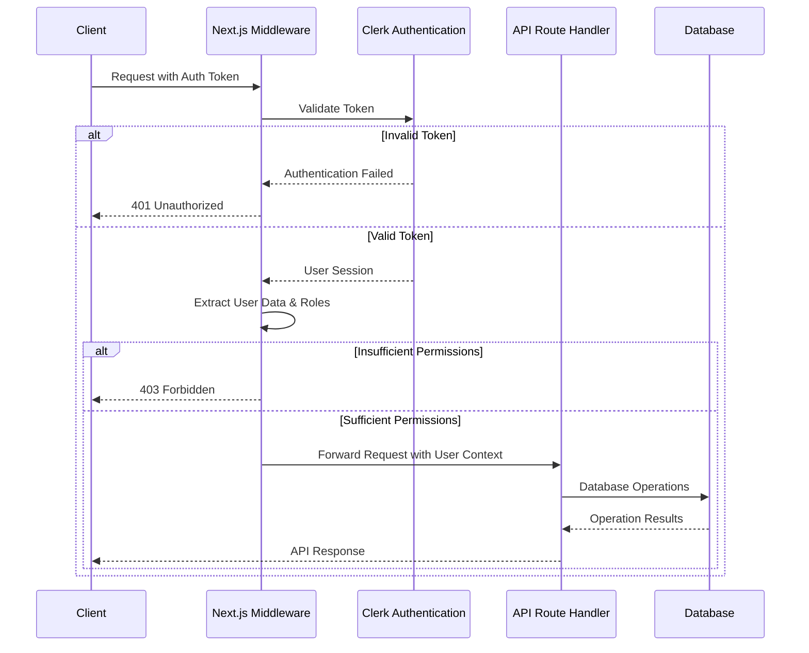
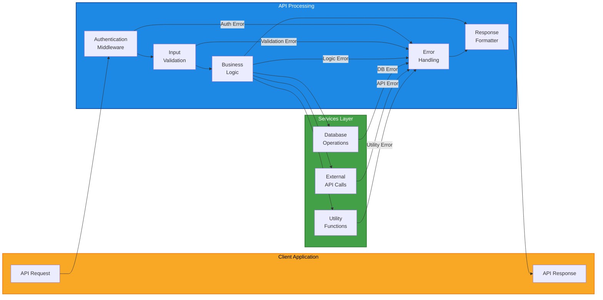
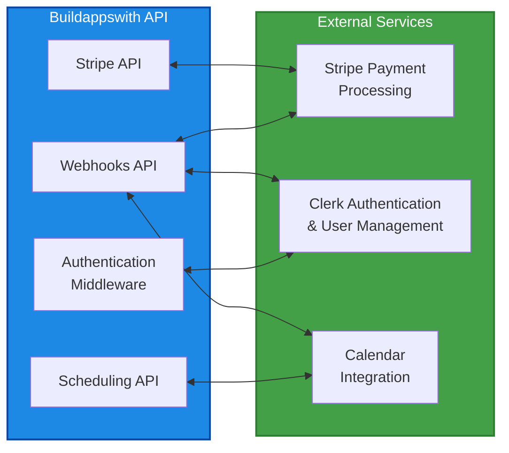
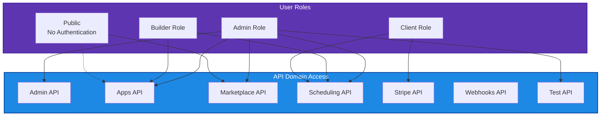

# API Architecture Diagram

*Version: 1.0.141*

This document provides a visual representation of the Buildappswith API architecture using Mermaid diagrams. These diagrams illustrate the relationships between different API domains, authentication flow, and request/response patterns.

## API Domain Overview

The following diagram illustrates the organization of the Buildappswith API by domain and their relationships:

```mermaid
flowchart TB
    Client([Client Application])
    
    subgraph API["Buildappswith API"]
        Admin["Admin API<br>/api/admin/*"]
        Apps["Apps API<br>/api/apps/*"]
        Marketplace["Marketplace API<br>/api/marketplace/*"]
        Scheduling["Scheduling API<br>/api/scheduling/*"]
        Stripe["Stripe API<br>/api/stripe/*"]
        Webhooks["Webhooks API<br>/api/webhooks/*"]
        Test["Test API<br>/api/test/*"]
    end
    
    subgraph External["External Services"]
        ClerkAuth["Clerk Authentication"]
        StripePayment["Stripe Payment"]
        CalendarService["Calendar Integration"]
    end
    
    subgraph Database["Database Layer"]
        Users[("Users")]
        BuilderProfiles[("Builder Profiles")]
        SessionTypes[("Session Types")]
        Bookings[("Bookings")]
        Availability[("Availability")]
        Apps_DB[("Apps")]
        Payments[("Payments")]
    end
    
    % Client connections
    Client -- "Authentication" --> ClerkAuth
    Client -- "API Requests" --> API
    
    % API to Database
    Admin --> Users
    Admin --> BuilderProfiles
    Admin --> SessionTypes
    
    Apps --> Apps_DB
    Apps --> BuilderProfiles
    
    Marketplace --> BuilderProfiles
    Marketplace --> Users
    
    Scheduling --> Bookings
    Scheduling --> SessionTypes
    Scheduling --> Availability
    Scheduling --> BuilderProfiles
    
    Stripe --> Payments
    Stripe --> Bookings
    
    % External integrations
    Webhooks <--> ClerkAuth
    Webhooks <--> StripePayment
    Webhooks <--> CalendarService
    
    Stripe <--> StripePayment
    
    % Authentication flow
    ClerkAuth -- "Session Validation" --> API
    
    % Test API connections
    Test -.-> Users
    
    % Relationships between APIs
    Scheduling -- "Builder Validation" --> Marketplace
    Stripe -- "Booking References" --> Scheduling
    
    class Client primary
    class API secondary
    class External tertiary
    class Database quaternary
    
    classDef primary fill:#f9a825,stroke:#f57f17,stroke-width:2px,color:#000
    classDef secondary fill:#1e88e5,stroke:#0d47a1,stroke-width:2px,color:#fff
    classDef tertiary fill:#43a047,stroke:#2e7d32,stroke-width:2px,color:#fff
    classDef quaternary fill:#5e35b1,stroke:#4527a0,stroke-width:2px,color:#fff
```

## Authentication Flow

The following diagram illustrates the authentication flow for the Buildappswith API:



## Request/Response Flow

The following diagram illustrates the typical request/response flow for API endpoints:



## Integration with External Services

The following diagram illustrates how the Buildappswith API integrates with external services:



## Role-Based Access Control

The following diagram illustrates the role-based access control for different API domains:



These diagrams provide a visual representation of the Buildappswith API architecture to help developers understand the system's structure and interactions.
