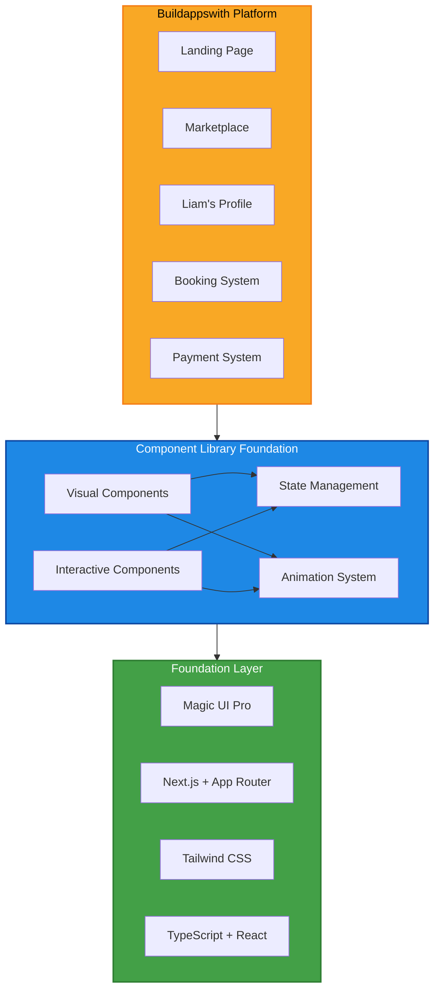
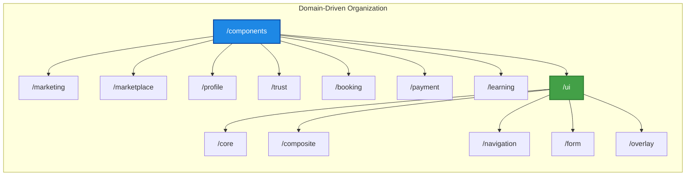
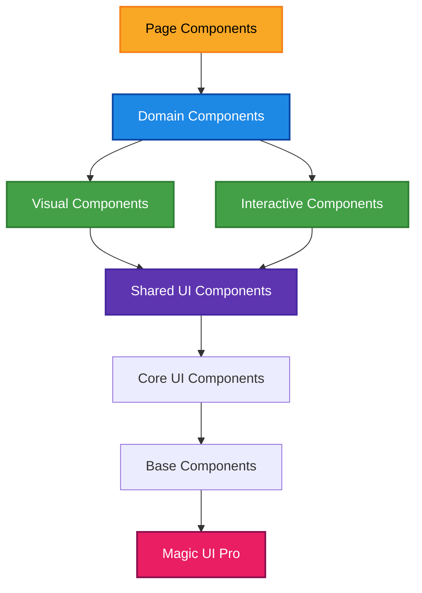
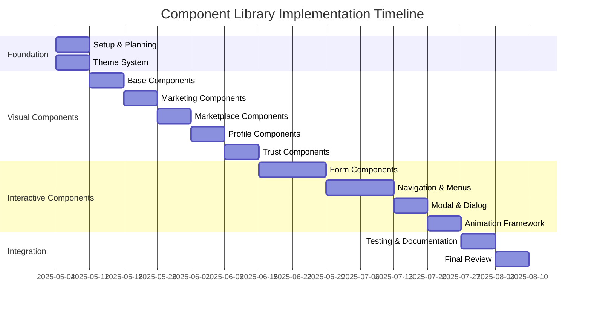
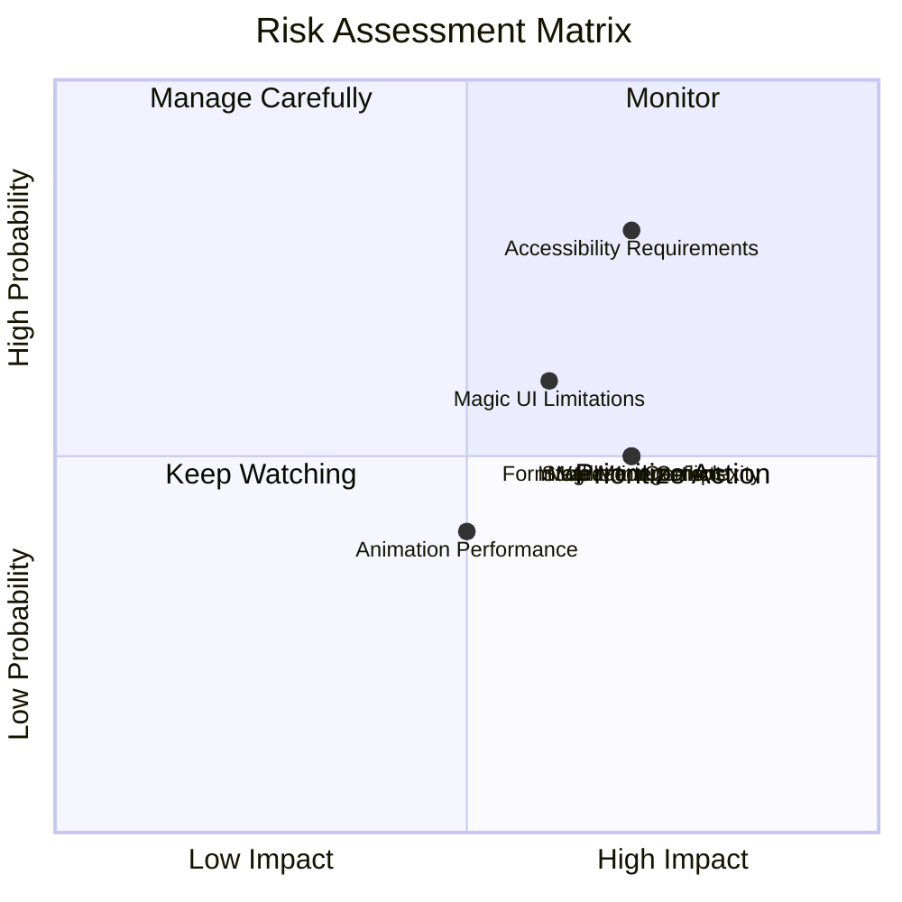
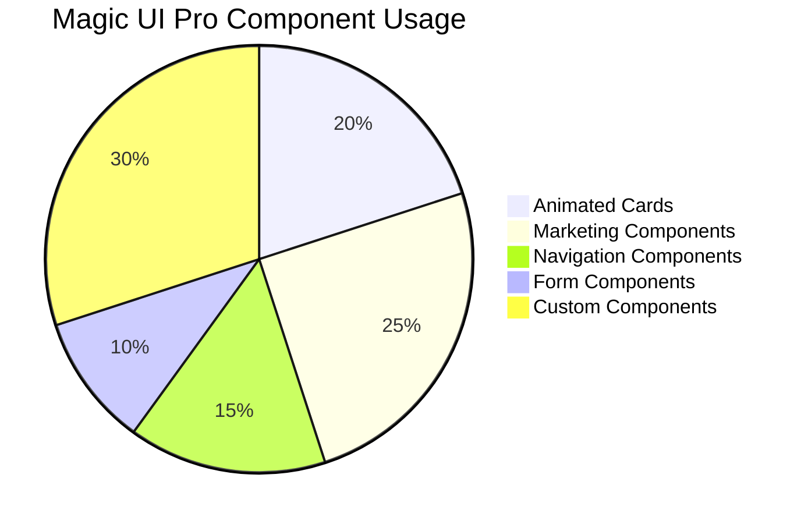
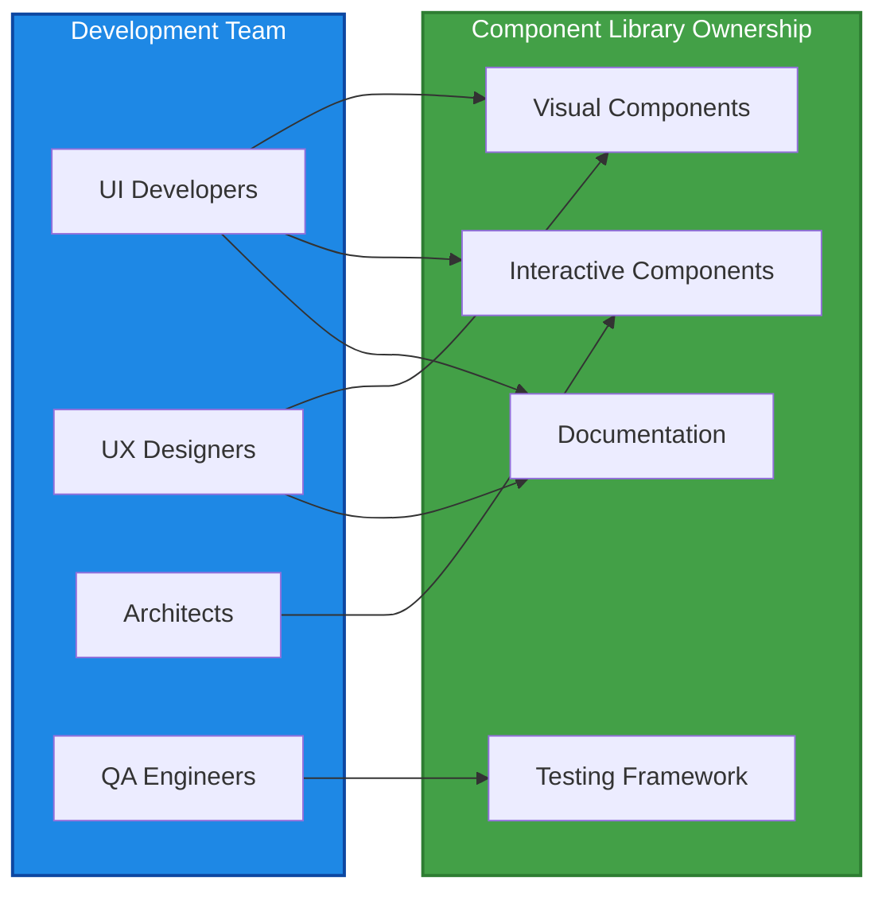
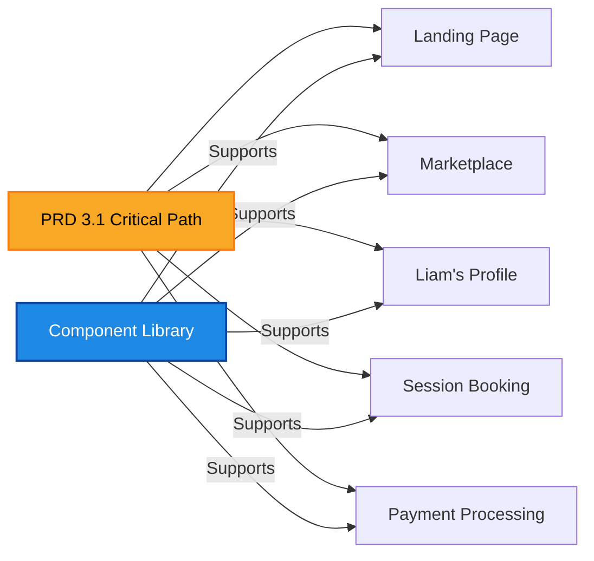

# Component Library Architecture Summary

**Issue**: BUI-89 - Component Library Foundation  
**Date**: May 3, 2025  
**Session Type**: Planning (Conclusion)  
**Version**: 1.0

## 1. High-Level Architecture Overview

## 2. Component Organization Structure

## 3. Component Hierarchy

## 4. Implementation Timeline

## 5. Risk Matrix

## 6. Component Distribution

## 7. Team Responsibility

## 8. Critical Path Alignment

## 9. Architecture Decisions

| Decision Area | Choice | Rationale |
|--------------|--------|-----------|
| **Component Organization** | Domain-driven | Aligns with business needs, improves maintainability |
| **UI Library** | Magic UI Pro | Accelerates development, ensures quality |
| **Component Composition** | Wrapper pattern | Maintains flexibility, enables customization |
| **State Management** | Progressive approach | Start simple, scale as needed |
| **Animation Framework** | Framer Motion | Industry standard, performance optimized |
| **Testing Strategy** | Comprehensive | Ensures quality and accessibility |

## 10. Next Steps

1. **Review & Approval**
   - Stakeholder review session
   - Address feedback and concerns
   - Obtain final approval

2. **Implementation Kickoff**
   - Set up development environment
   - Begin visual component implementation
   - Establish testing framework

3. **First Sprint Focus**
   - Magic UI Pro component integration
   - Theme system setup
   - Base component development

This architecture summary provides a clear, visual representation of the Component Library Foundation that can be used in the review session to communicate the comprehensive planning work completed.
