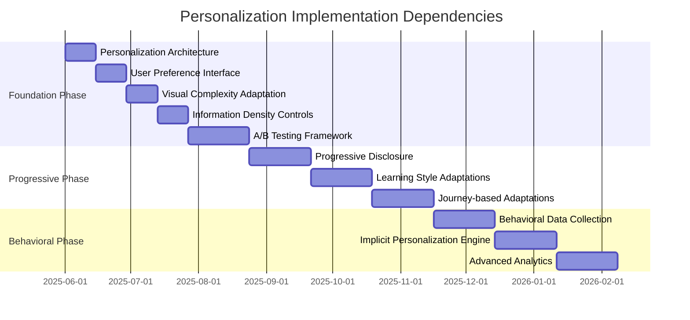

I'll continue with the Transition and Animation Framework section and complete the remaining parts of the document.

```javascript
export const getAnimationVariants = (component, config) => {
  // No animations for reduced motion
  if (!config.transitions) {
    return {
      initial: {},
      animate: {},
      exit: {}
    };
  }
  
  // Base animations for all components
  const baseVariants = {
    initial: { opacity: 0 },
    animate: { opacity: 1 },
    exit: { opacity: 0 }
  };
  
  // Component-specific animations
  switch (component) {
    case 'card':
      return {
        initial: { ...baseVariants.initial, y: 20, scale: 0.98 },
        animate: { 
          ...baseVariants.animate, 
          y: 0, 
          scale: 1,
          transition: {
            ...getTransitionProperties(config),
            staggerChildren: config.advanced ? 0.1 : 0
          }
        },
        exit: { ...baseVariants.exit, y: -20, scale: 0.98 }
      };
      
    case 'modal':
      return {
        initial: { ...baseVariants.initial, scale: config.effects ? 0.9 : 1 },
        animate: { 
          ...baseVariants.animate, 
          scale: 1,
          transition: {
            ...getTransitionProperties(config),
            type: config.advanced ? 'spring' : 'tween',
            stiffness: 300,
            damping: 30
          }
        },
        exit: { 
          ...baseVariants.exit, 
          scale: config.effects ? 0.9 : 1,
          transition: {
            ...getTransitionProperties(config),
            duration: config.duration * 0.75
          }
        }
      };
      
    case 'listItem':
      return {
        initial: { ...baseVariants.initial, x: -20 },
        animate: { ...baseVariants.animate, x: 0 },
        exit: { ...baseVariants.exit, x: 20 }
      };
      
    // Add more component-specific animations as needed
      
    default:
      return baseVariants;
  }
};

// Helper for staggered children animations
export const getStaggeredChildVariants = (config, index = 0) => {
  if (!config.transitions) {
    return {
      initial: {},
      animate: {},
      exit: {}
    };
  }
  
  return {
    initial: { opacity: 0, y: 10 },
    animate: { 
      opacity: 1, 
      y: 0,
      transition: {
        ...getTransitionProperties(config),
        delay: config.advanced ? index * 0.05 : 0
      }
    },
    exit: { opacity: 0, y: -10 }
  };
};
```

#### Adaptive Animation Hook

```jsx
// useAdaptiveAnimation.jsx
import { useReducedMotion } from 'framer-motion';
import { usePersonalization } from '@/contexts/PersonalizationContext';
import { getAnimationConfig, getAnimationVariants, getStaggeredChildVariants } from './animationService';

export function useAdaptiveAnimation(componentType) {
  const { userPersonalization } = usePersonalization();
  const prefersReducedMotion = useReducedMotion();
  
  // Get animation level from user preferences
  const animationLevel = userPersonalization.preferences.animationLevel || 'standard';
  
  // Create animation configuration
  const config = getAnimationConfig(animationLevel, prefersReducedMotion);
  
  // Get component-specific animation variants
  const variants = getAnimationVariants(componentType, config);
  
  // Function to get child variants with staggered animations
  const getChildVariants = (index = 0) => {
    return getStaggeredChildVariants(config, index);
  };
  
  // Helper to generate transition props
  const getTransition = (customProps = {}) => {
    if (!config.transitions) {
      return {};
    }
    
    return {
      transition: {
        duration: config.duration,
        ease: config.advanced ? [0.6, -0.05, 0.01, 0.99] : 'easeInOut',
        ...customProps
      }
    };
  };
  
  return {
    config,
    variants,
    getChildVariants,
    getTransition,
    hasAnimations: config.transitions
  };
}
```

#### Implementing Adaptive Animations

```jsx
// AnimatedCard.jsx
import { motion } from 'framer-motion';
import { useAdaptiveAnimation } from '@/hooks/useAdaptiveAnimation';

export function AnimatedCard({ title, description, children, className = '', ...props }) {
  const { variants, getChildVariants, hasAnimations } = useAdaptiveAnimation('card');
  
  // If animations are disabled, render without motion components
  if (!hasAnimations) {
    return (
      <div className={`rounded-lg border p-4 ${className}`} {...props}>
        {title && <h3 className="text-lg font-medium">{title}</h3>}
        {description && <p className="mt-2 text-gray-600">{description}</p>}
        {children}
      </div>
    );
  }
  
  return (
    <motion.div
      className={`rounded-lg border p-4 ${className}`}
      variants={variants}
      initial="initial"
      animate="animate"
      exit="exit"
      {...props}
    >
      {title && (
        <motion.h3 
          className="text-lg font-medium"
          variants={getChildVariants(0)}
        >
          {title}
        </motion.h3>
      )}
      
      {description && (
        <motion.p 
          className="mt-2 text-gray-600"
          variants={getChildVariants(1)}
        >
          {description}
        </motion.p>
      )}
      
      {children}
    </motion.div>
  );
}
```

## 5. Magic UI Component Adaptations

### 5.1 Component Adaptation Table

The following table provides a comprehensive mapping of Magic UI components to personalization opportunities, with clear specifications for implementation:

| Component | Explorer Level | Practitioner Level | Expert Level | Personalization Parameters | Implementation Approach |
|-----------|----------------|---------------------|--------------|----------------------------|-------------------------|
| **BorderBeam** | Simple border highlight with minimal movement | Moderate border animation with color transitions | Rich border effects with dynamic movement | `speed`, `colorScheme`, `intensity` | Use `speed` based on visual complexity, `colorScheme` based on user role, and `intensity` based on information importance |
| **SpotlightCard** | Static spotlight effect | Dynamic spotlight following cursor | Multi-color spotlight with advanced tracking | `size`, `behavior`, `colorIntensity` | Reduce size and behavior complexity for explorers, increase for experts |
| **Typewriter** | Single text transition at moderate speed | Variable speed transitions with pause effects | Multiple text transitions with dynamic timing | `speed`, `complexity`, `words` | Adjust number of variations and transition speed based on expertise level |
| **FloatingNavbar** | Simple opacity-based appearance | Smooth slide-in with backdrop blur | Advanced reveal with context-aware animations | `effect`, `animationComplexity`, `transitionTiming` | Implement progressive enhancement based on user expertise and preferences |
| **InfiniteMovingCards** | Basic horizontal scrolling | Multi-directional scrolling with variable speeds | Dynamic scrolling with content-aware pacing | `direction`, `speed`, `pauseOnHover` | Adjust complexity and interactivity based on user engagement patterns |
| **ButtonGlowEffect** | Subtle glow on hover | Animated glow with color transitions | Dynamic glow with custom behavior | `glowSize`, `glowOpacity`, `glowColor` | Scale effect based on visual complexity preference |
| **StickyScrollReveal** | Simple fade-in elements | Coordinated reveal with subtle animations | Complex parallax effects with content highlighting | `revealStyle`, `timing`, `parallaxIntensity` | Progressive enhancement based on expertise level and scroll behavior |
| **3DCard** | Limited 3D effect with minimal movement | Moderate 3D transformations on interaction | Rich 3D experiences with dynamic lighting | `depth`, `rotationIntensity`, `lightingEffects` | Scale effect complexity based on visual preference and device capability |
| **TextReveal** | Simple fade-in text | Character-by-character reveal | Advanced mask-based text animations | `revealStyle`, `speed`, `complexity` | Adapt based on text importance and user expertise |
| **MagicTabBar** | Basic underline indicator | Animated pill with subtle transitions | Dynamic indicator with custom behaviors | `indicatorStyle`, `transitionType`, `animationComplexity` | Progressive enhancement based on expertise level |

### 5.2 Component-Specific Implementation Guidelines

#### BorderBeam Component Adaptation

The BorderBeam component provides an animated border effect that can be personalized based on user preferences and expertise:

```jsx
// AdaptiveBorderBeam.jsx
import { BorderBeam } from '@/components/magicui';
import { usePersonalization } from '@/contexts/PersonalizationContext';
import { useReducedMotion } from 'framer-motion';

export function AdaptiveBorderBeam({ importance = 'medium', ...props }) {
  const { getAdaptationLevel, userPersonalization } = usePersonalization();
  const prefersReducedMotion = useReducedMotion();
  
  // Get visual complexity level
  const visualComplexity = getAdaptationLevel('visualComplexity');
  
  // Honor reduced motion preference
  if (prefersReducedMotion) {
    return null; // Don't render animation for users who prefer reduced motion
  }
  
  // Map complexity level to animation parameters
  const getAnimationParams = () => {
    // Base settings for all levels
    const baseParams = {
      size: 20,
      duration: 2.5,
      delay: 0.5,
      colorFrom: 'from-blue-500/20',
      colorTo: 'to-blue-500/0'
    };
    
    // Adjust based on visual complexity
    switch (visualComplexity) {
      case 1: // Explorer
        return {
          ...baseParams,
          size: 10, // Smaller effect
          duration: 2, // Shorter duration
          delay: 0, // No delay
          colorFrom: 'from-blue-400/10', // Subtle color
          colorTo: 'to-blue-400/0'
        };
        
      case 2: // Practitioner
        return baseParams; // Default settings
        
      case 3: // Expert
        return {
          ...baseParams,
          size: 30, // Larger effect
          duration: 3, // Longer duration
          colorFrom: 'from-blue-600/30', // More vivid color
          colorTo: 'to-purple-500/0' // Gradient effect
        };
        
      default:
        return baseParams;
    }
  };
  
  // Adjust importance-based parameters
  const adjustForImportance = (params) => {
    switch (importance) {
      case 'high':
        return {
          ...params,
          size: params.size * 1.5,
          colorFrom: params.colorFrom.replace('blue', 'indigo')
        };
        
      case 'low':
        return {
          ...params,
          size: params.size * 0.7,
          colorFrom: params.colorFrom.replace('/20', '/10')
        };
        
      default:
        return params;
    }
  };
  
  // Get final parameters
  const animationParams = adjustForImportance(getAnimationParams());
  
  return (
    <BorderBeam
      size={animationParams.size}
      duration={animationParams.duration}
      delay={animationParams.delay}
      colorFrom={animationParams.colorFrom}
      colorTo={animationParams.colorTo}
      {...props}
    />
  );
}
```

#### SpotlightCard Component Adaptation

The SpotlightCard component creates a dynamic spotlight effect that can be personalized based on user expertise:

```jsx
// AdaptiveSpotlight.jsx
import { Spotlight, SpotlightCard } from '@/components/magicui';
import { usePersonalization } from '@/contexts/PersonalizationContext';
import { useReducedMotion } from 'framer-motion';

export function AdaptiveSpotlight({ children, className = '', ...props }) {
  const { getAdaptationLevel } = usePersonalization();
  const prefersReducedMotion = useReducedMotion();
  
  // Get visual complexity level
  const visualComplexity = getAdaptationLevel('visualComplexity');
  
  // For reduced motion preference, render without animation
  if (prefersReducedMotion) {
    return (
      <div className={className} {...props}>
        {children}
      </div>
    );
  }
  
  // For Explorer level, use a simple static effect
  if (visualComplexity === 1) {
    return (
      <div className={`relative ${className}`} {...props}>
        <div className="absolute top-1/2 left-1/2 -translate-x-1/2 -translate-y-1/2 w-32 h-32 bg-blue-400/20 rounded-full blur-xl" />
        <div className="relative z-10">{children}</div>
      </div>
    );
  }
  
  // For Practitioner level, use standard spotlight
  if (visualComplexity === 2) {
    return (
      <Spotlight
        className={`-z-10 ${className}`}
        fill="blue"
        size={300}
        {...props}
      >
        {children}
      </Spotlight>
    );
  }
  
  // For Expert level, use enhanced spotlight card
  return (
    <SpotlightCard
      className={className}
      fill="blue"
      size={400}
      spotlight={{ color: 'blue', intensity: 0.4 }}
      {...props}
    >
      {children}
    </SpotlightCard>
  );
}
```

#### Typewriter Component Adaptation

The Typewriter component creates text animation effects that can be personalized based on expertise level:

```jsx
// AdaptiveTypewriter.jsx
import { Typewriter } from '@/components/magicui';
import { usePersonalization } from '@/contexts/PersonalizationContext';
import { useReducedMotion } from 'framer-motion';

export function AdaptiveTypewriter({ words, className = '', ...props }) {
  const { getAdaptationLevel, userPersonalization } = usePersonalization();
  const prefersReducedMotion = useReducedMotion();
  
  // Get visual complexity and information density levels
  const visualComplexity = getAdaptationLevel('visualComplexity');
  const informationDensity = getAdaptationLevel('informationDensity');
  
  // For reduced motion preference, render static text
  if (prefersReducedMotion) {
    return (
      <span className={className} {...props}>
        {words[0]}
      </span>
    );
  }
  
  // Determine how many words to display based on information density
  const getWordCount = () => {
    switch (informationDensity) {
      case 1: return Math.min(2, words.length);
      case 2: return Math.min(4, words.length);
      case 3: return words.length;
      default: return Math.min(2, words.length);
    }
  };
  
  // Configure animation speed based on visual complexity
  const getSpeed = () => {
    switch (visualComplexity) {
      case 1: return 'slow'; // Slower for explorers
      case 2: return 'normal'; // Standard speed for practitioners
      case 3: return 'fast'; // Faster for experts
      default: return 'normal';
    }
  };
  
  // Get filtered words based on information density
  const filteredWords = words.slice(0, getWordCount());
  
  return (
    <Typewriter
      words={filteredWords}
      speed={getSpeed()}
      className={className}
      {...props}
    />
  );
}
```

#### 3D Card Component Adaptation

The 3D Card component creates a dynamic 3D effect that can be personalized based on expertise level and device capabilities:

```jsx
// Adaptive3DCard.jsx
import { useState, useEffect } from 'react';
import { motion } from 'framer-motion';
import { ThreeDCard } from '@/components/magicui';
import { usePersonalization } from '@/contexts/PersonalizationContext';
import { useReducedMotion } from 'framer-motion';

export function Adaptive3DCard({ children, className = '', ...props }) {
  const { getAdaptationLevel, userPersonalization } = usePersonalization();
  const prefersReducedMotion = useReducedMotion();
  const [deviceCapability, setDeviceCapability] = useState('high');
  
  // Determine device capability on mount
  useEffect(() => {
    // Simple heuristic based on device memory and processor cores
    const checkDeviceCapability = () => {
      // Check if navigator.deviceMemory is available (Chrome)
      const memory = navigator.deviceMemory || 4; // Default to 4GB if not available
      
      // Check if navigator.hardwareConcurrency is available
      const cores = navigator.hardwareConcurrency || 4; // Default to 4 cores
      
      if (memory <= 2 || cores <= 2) {
        setDeviceCapability('low');
      } else if (memory <= 4 || cores <= 4) {
        setDeviceCapability('medium');
      } else {
        setDeviceCapability('high');
      }
    };
    
    checkDeviceCapability();
  }, []);
  
  // Get visual complexity level
  const visualComplexity = getAdaptationLevel('visualComplexity');
  
  // If reduced motion is preferred or device capability is low, render without 3D effect
  if (prefersReducedMotion || deviceCapability === 'low') {
    return (
      <div className={`rounded-xl border p-4 ${className}`} {...props}>
        {children}
      </div>
    );
  }
  
  // Map complexity level to card parameters
  const getCardParams = () => {
    // Base settings
    const baseParams = {
      rotationIntensity: 0.3,
      scale: 1.05,
      glareOpacity: 0.2
    };
    
    // Adjust based on visual complexity
    switch (visualComplexity) {
      case 1: // Explorer
        return {
          ...baseParams,
          rotationIntensity: 0.1, // Minimal rotation
          scale: 1.02, // Minimal scaling
          glareOpacity: 0.1 // Subtle glare
        };
        
      case 2: // Practitioner
        return baseParams; // Default settings
        
      case 3: // Expert
        return {
          ...baseParams,
          rotationIntensity: 0.5, // More pronounced rotation
          scale: 1.08, // More pronounced scaling
          glareOpacity: 0.3, // More noticeable glare
          shadows: true // Additional shadow effects
        };
        
      default:
        return baseParams;
    }
  };
  
  // Also consider device capability
  const adjustForDevice = (params) => {
    if (deviceCapability === 'medium') {
      return {
        ...params,
        rotationIntensity: params.rotationIntensity * 0.7,
        glareOpacity: params.glareOpacity * 0.7,
        shadows: false // Disable shadows for medium devices
      };
    }
    
    return params;
  };
  
  // Get final parameters
  const cardParams = adjustForDevice(getCardParams());
  
  return (
    <ThreeDCard
      className={className}
      rotationIntensity={cardParams.rotationIntensity}
      scale={cardParams.scale}
      glareOpacity={cardParams.glareOpacity}
      shadows={cardParams.shadows}
      {...props}
    >
      {children}
    </ThreeDCard>
  );
}
```

### 5.3 Component Adaptation Framework

To streamline the adaptation of Magic UI components, we can implement a higher-order component that handles personalization logic:

```jsx
// withAdaptation.jsx
import { usePersonalization } from '@/contexts/PersonalizationContext';
import { useReducedMotion } from 'framer-motion';

export function withAdaptation(Component, adaptationLogic) {
  return function AdaptedComponent(props) {
    const { getAdaptationLevel, userPersonalization } = usePersonalization();
    const prefersReducedMotion = useReducedMotion();
    
    // Get adaptation levels for various dimensions
    const adaptationLevels = {
      visualComplexity: getAdaptationLevel('visualComplexity'),
      informationDensity: getAdaptationLevel('informationDensity'),
      guidanceLevel: getAdaptationLevel('guidanceLevel'),
      terminologySophistication: getAdaptationLevel('terminologySophistication')
    };
    
    // Apply component-specific adaptation logic
    const adaptedProps = adaptationLogic({
      props,
      levels: adaptationLevels,
      preferences: userPersonalization.preferences,
      reducedMotion: prefersReducedMotion
    });
    
    // Render component with adapted props
    return <Component {...adaptedProps} />;
  };
}
```

Usage example:

```jsx
// AdaptedBorderBeam.jsx
import { BorderBeam } from '@/components/magicui';
import { withAdaptation } from './withAdaptation';

const adaptBorderBeam = ({ props, levels, reducedMotion }) => {
  // Honor reduced motion preference
  if (reducedMotion) {
    return { ...props, render: false };
  }
  
  // Base properties
  const adaptedProps = { ...props };
  
  // Adapt size based on visual complexity
  switch (levels.visualComplexity) {
    case 1: // Explorer
      adaptedProps.size = 10;
      adaptedProps.duration = 2;
      adaptedProps.colorFrom = 'from-blue-400/10';
      adaptedProps.colorTo = 'to-blue-400/0';
      break;
      
    case 2: // Practitioner
      adaptedProps.size = 20;
      adaptedProps.duration = 2.5;
      adaptedProps.colorFrom = 'from-blue-500/20';
      adaptedProps.colorTo = 'to-blue-500/0';
      break;
      
    case 3: // Expert
      adaptedProps.size = 30;
      adaptedProps.duration = 3;
      adaptedProps.colorFrom = 'from-blue-600/30';
      adaptedProps.colorTo = 'to-purple-500/0';
      break;
  }
  
  return adaptedProps;
};

export const AdaptedBorderBeam = withAdaptation(BorderBeam, adaptBorderBeam);
```

### 5.4 Animation Performance Optimization

To ensure smooth performance across devices, we implement adaptive animation throttling:

```javascript
// animationOptimizer.js
export class AnimationOptimizer {
  constructor() {
    this.devicePerformance = this.detectDevicePerformance();
    this.adaptationFactors = this.calculateAdaptationFactors();
  }
  
  // Detect device performance capabilities
  detectDevicePerformance() {
    // Basic device performance detection
    const memory = navigator.deviceMemory || 4; // Default to 4GB
    const cores = navigator.hardwareConcurrency || 4; // Default to 4 cores
    
    // Check if device is low-end
    if (memory <= 2 || cores <= 2) {
      return 'low';
    }
    
    // Check if device is mid-range
    if (memory <= 4 || cores <= 4) {
      return 'medium';
    }
    
    // High-end device
    return 'high';
  }
  
  // Calculate adaptation factors based on device performance
  calculateAdaptationFactors() {
    switch (this.devicePerformance) {
      case 'low':
        return {
          animationCount: 0.3, // Reduce number of animations by 70%
          animationComplexity: 0.5, // Reduce animation complexity by 50%
          parallaxEffects: false, // Disable parallax effects
          particleEffects: false, // Disable particle effects
          blurEffects: false // Disable blur effects
        };
        
      case 'medium':
        return {
          animationCount: 0.7, // Reduce number of animations by 30%
          animationComplexity: 0.8, // Reduce animation complexity by 20%
          parallaxEffects: true, // Enable parallax effects
          particleEffects: false, // Disable particle effects
          blurEffects: true // Enable blur effects
        };
        
      case 'high':
      default:
        return {
          animationCount: 1, // Full animations
          animationComplexity: 1, // Full complexity
          parallaxEffects: true, // Enable parallax effects
          particleEffects: true, // Enable particle effects
          blurEffects: true // Enable blur effects
        };
    }
  }
  
  // Check if particular animation should be rendered
  shouldRenderAnimation(priority = 'medium') {
    // Always render high-priority animations
    if (priority === 'high') {
      return true;
    }
    
    // For medium and low priority, check against device capabilities
    const { animationCount } = this.adaptationFactors;
    
    if (priority === 'low' && animationCount < 0.7) {
      return false;
    }
    
    if (priority === 'medium' && animationCount < 0.4) {
      return false;
    }
    
    return true;
  }
  
  // Get adapted animation parameters
  getAdaptedAnimationParams(baseParams) {
    const { animationComplexity } = this.adaptationFactors;
    
    // Simplify animations based on device capabilities
    return {
      duration: baseParams.duration * (0.8 + (0.2 * animationComplexity)),
      delay: baseParams.delay * animationComplexity,
      intensity: baseParams.intensity * animationComplexity,
      particleCount: Math.floor(baseParams.particleCount * animationComplexity),
      blurAmount: baseParams.blurAmount * (this.adaptationFactors.blurEffects ? 1 : 0)
    };
  }
  
  // Check if effect type is supported
  isEffectSupported(effectType) {
    switch (effectType) {
      case 'parallax':
        return this.adaptationFactors.parallaxEffects;
        
      case 'particles':
        return this.adaptationFactors.particleEffects;
        
      case 'blur':
        return this.adaptationFactors.blurEffects;
        
      default:
        return true;
    }
  }
}

// Singleton instance for global use
export const animationOptimizer = new AnimationOptimizer();
```

## 6. Measurement & Validation Plan

### 6.1 Key Personalization Metrics

To evaluate the effectiveness of personalization features, we will track the following key metrics:

| Metric Category | Specific Metrics | Data Collection Method | Success Criteria |
|-----------------|------------------|--------------------------|------------------|
| **Engagement** | Session duration, Feature discovery rate, Return frequency | Web analytics, In-app tracking | 30% increase in session duration, 40% increase in feature discovery |
| **Learning Effectiveness** | Knowledge retention, Skill application success, Concept understanding | Quiz performance, Project completion rates | 25% improvement in concept understanding, 35% increase in successful project completion |
| **User Satisfaction** | Net Promoter Score, Feature satisfaction, Perceived value | In-app surveys, Feedback forms | NPS > 50, 85% feature satisfaction rating |
| **Cognitive Load** | Task completion time, Error rate, Self-reported difficulty | Task timing, Error tracking, Surveys | 40% reduction in errors, 25% reduction in self-reported difficulty |
| **Feature Adoption** | Progressive feature usage, Advanced capability discovery | Feature tracking, User progression | 30% increase in advanced feature adoption |
| **Retention** | 30/60/90 day retention, User journey progression | Cohort analysis, Progression tracking | 40% improvement in 90-day retention rates |

### 6.2 A/B Testing Methodology

We will implement a comprehensive A/B testing strategy to validate personalization effectiveness:

#### Test Design Framework

```javascript
// testingFramework.js
export class PersonalizationTest {
  constructor(testId, description, hypothesis) {
    this.testId = testId;
    this.description = description;
    this.hypothesis = hypothesis;
    this.variants = [];
    this.metrics = [];
    this.targetSegments = [];
    this.sampleSize = 0;
    this.duration = 0;
  }
  
  // Add test variant
  addVariant(variantId, description, personalizationConfig) {
    this.variants.push({
      variantId,
      description,
      personalizationConfig
    });
    
    return this;
  }
  
  // Add success metrics
  addMetrics(metrics) {
    this.metrics = [...this.metrics, ...metrics];
    return this;
  }
  
  // Set target user segments
  setTargetSegments(segments) {
    this.targetSegments = segments;
    return this;
  }
  
  // Set sample size
  setSampleSize(sampleSize) {
    this.sampleSize = sampleSize;
    return this;
  }
  
  // Set test duration
  setDuration(days) {
    this.duration = days;
    return this;
  }
  
  // Validate test configuration
  validate() {
    // Ensure at least two variants (control and test)
    if (this.variants.length < 2) {
      throw new Error('Test must have at least two variants');
    }
    
    // Ensure metrics are defined
    if (this.metrics.length === 0) {
      throw new Error('Test must have at least one metric');
    }
    
    // Additional validation rules...
    
    return true;
  }
  
  // Generate test plan document
  generateTestPlan() {
    return {
      testId: this.testId,
      description: this.description,
      hypothesis: this.hypothesis,
      variants: this.variants,
      metrics: this.metrics,
      targetSegments: this.targetSegments,
      sampleSize: this.sampleSize,
      duration: this.duration,
      status: 'planned'
    };
  }
}
```

#### Example Test Definition

```javascript
// example-personalization-test.js
import { PersonalizationTest } from './testingFramework';

export const progressiveCardTest = new PersonalizationTest(
  'progressive-card-test-001',
  'Testing the effectiveness of progressive card complexity',
  'Users exposed to adaptively complex cards based on expertise will have higher engagement and retention than those with static card designs'
)
  .addVariant('control', 'Static card design for all users', {
    enableAdaptation: false,
    cardDesign: 'standard'
  })
  .addVariant('test-a', 'Progressive card design based on expertise', {
    enableAdaptation: true,
    adaptationDimension: 'expertise',
    cardDesign: 'progressive'
  })
  .addVariant('test-b', 'Progressive card design based on behavior', {
    enableAdaptation: true,
    adaptationDimension: 'behavior',
    cardDesign: 'progressive'
  })
  .addMetrics([
    {
      id: 'card-interaction-rate',
      name: 'Card Interaction Rate',
      description: 'Percentage of users who interact with card content',
      type: 'percentage'
    },
    {
      id: 'task-completion-time',
      name: 'Task Completion Time',
      description: 'Average time to complete card-related tasks',
      type: 'duration'
    },
    {
      id: 'feature-discovery',
      name: 'Feature Discovery Rate',
      description: 'Percentage of card features discovered by users',
      type: 'percentage'
    }
  ])
  .setTargetSegments(['new-users', 'returning-users'])
  .setSampleSize(1000)
  .setDuration(14);
```

#### Test Implementation

```jsx
// TestVariantProvider.jsx
import { createContext, useContext, useState, useEffect } from 'react';

const TestVariantContext = createContext(null);

export function TestVariantProvider({ children }) {
  const [activeTests, setActiveTests] = useState({});
  const [loading, setLoading] = useState(true);
  
  // Load active tests on mount
  useEffect(() => {
    const loadActiveTests = async () => {
      try {
        const response = await fetch('/api/personalization/tests/active');
        
        if (response.ok) {
          const tests = await response.json();
          
          // Convert to map of testId -> assigned variant
          const testMap = {};
          tests.forEach(test => {
            testMap[test.testId] = test.assignedVariant;
          });
          
          setActiveTests(testMap);
        }
      } catch (error) {
        console.error('Error loading active tests:', error);
      } finally {
        setLoading(false);
      }
    };
    
    loadActiveTests();
  }, []);
  
  // Get assigned variant for a specific test
  const getAssignedVariant = (testId) => {
    return activeTests[testId] || null;
  };
  
  // Track test event
  const trackTestEvent = async (testId, variantId, eventType, eventData) => {
    try {
      await fetch('/api/personalization/tests/events', {
        method: 'POST',
        headers: {
          'Content-Type': 'application/json'
        },
        body: JSON.stringify({
          testId,
          variantId,
          eventType,
          eventData,
          timestamp: new Date().toISOString()
        })
      });
    } catch (error) {
      console.error('Error tracking test event:', error);
    }
  };
  
  // Context value
  const value = {
    getAssignedVariant,
    trackTestEvent,
    loading
  };
  
  return (
    <TestVariantContext.Provider value={value}>
      {children}
    </TestVariantContext.Provider>
  );
}

export function useTestVariant() {
  const context = useContext(TestVariantContext);
  if (!context) {
    throw new Error('useTestVariant must be used within a TestVariantProvider');
  }
  return context;
}
```

### 6.3 User Research Methods

In addition to quantitative metrics, we will implement qualitative research methodologies to evaluate personalization effectiveness:

#### 1. Think-Aloud Studies

We will conduct think-aloud studies with participants from each user segment (builder, client, learner) at different expertise levels to:

- Capture real-time reactions to interface adaptations
- Identify confusion points or unexpected behavior
- Understand how personalization affects mental models
- Evaluate perceived value of adaptive features

#### 2. Task-Based Usability Testing

Structured task scenarios will evaluate how personalization affects task completion:

```javascript
// Example task scenario
const taskScenario = {
  id: 'client-builder-discovery',
  description: 'Finding a suitable builder for an AI project',
  userType: 'client',
  expertiseLevel: ['explorer', 'practitioner', 'expert'],
  steps: [
    'Navigate to the marketplace',
    'Filter builders by relevant criteria',
    'Compare at least three builder profiles',
    'Select a builder and initiate contact'
  ],
  metrics: [
    'Time to complete full task',
    'Number of navigation errors',
    'Filter usage patterns',
    'Information referenced during decision-making',
    'Self-reported confidence in selection'
  ],
  successCriteria: [
    'Task completion without assistance',
    'Selection of appropriately matched builder',
    'Confidence rating of 4+ on 5-point scale'
  ]
};
```

#### 3. Longitudinal Studies

To evaluate personalization effectiveness over time, we will implement:

- Journey tracking for a cohort of users from onboarding through 90 days
- Weekly diary studies capturing evolving perceptions
- Periodic interviews at 30/60/90 day milestones
- Expertise assessment to measure skill development

#### 4. Eye-Tracking Studies

For selected components, we will conduct eye-tracking studies to:

- Measure visual attention to personalized elements
- Identify scanning patterns across expertise levels
- Evaluate information discovery effectiveness
- Compare cognitive processing across interface variations

### 6.4 Personalization Effectiveness Dashboard

We will develop a comprehensive dashboard for monitoring personalization effectiveness:

```jsx
// PersonalizationDashboard.jsx (Concept)
import { useState } from 'react';
import { LineChart, BarChart, PieChart, ScatterPlot } from '@/components/charts';
import { Card, Select, DateRangePicker, Tabs } from '@/components/ui';

export function PersonalizationDashboard() {
  const [dateRange, setDateRange] = useState({
    start: new Date(Date.now() - 30 * 24 * 60 * 60 * 1000),
    end: new Date()
  });
  
  const [userSegment, setUserSegment] = useState('all');
  const [metricView, setMetricView] = useState('engagement');
  
  // This would be loaded from API
  const dashboardData = {
    // Metrics data would be loaded here
  };
  
  return (
    <div className="space-y-6 p-6">
      <h1 className="text-2xl font-bold">Personalization Effectiveness Dashboard</h1>
      
      {/* Dashboard controls */}
      <div className="flex flex-wrap gap-4">
        <DateRangePicker
          value={dateRange}
          onChange={setDateRange}
        />
        
        <Select
          value={userSegment}
          onChange={setUserSegment}
          options={[
            { label: 'All Users', value: 'all' },
            { label: 'Builders', value: 'builders' },
            { label: 'Clients', value: 'clients' },
            { label: 'Learners', value: 'learners' }
          ]}
        />
        
        <Select
          value={metricView}
          onChange={setMetricView}
          options={[
            { label: 'Engagement', value: 'engagement' },
            { label: 'Learning', value: 'learning' },
            { label: 'User Satisfaction', value: 'satisfaction' },
            { label: 'Feature Adoption', value: 'adoption' },
            { label: 'Retention', value: 'retention' }
          ]}
        />
      </div>
      
      {/* Key metrics overview */}
      <div className="grid grid-cols-1 md:grid-cols-4 gap-4">
        <MetricCard
          title="Avg. Session Duration"
          value="12:45"
          change="+24%"
          trend="up"
        />
        
        <MetricCard
          title="Feature Discovery"
          value="68%"
          change="+32%"
          trend="up"
        />
        
        <MetricCard
          title="90-Day Retention"
          value="72%"
          change="+18%"
          trend="up"
        />
        
        <MetricCard
          title="User Satisfaction"
          value="87%"
          change="+12%"
          trend="up"
        />
      </div>
      
      {/* Detailed metrics view */}
      <Card className="p-6">
        <Tabs
          value={metricView}
          onChange={setMetricView}
          tabs={[
            { value: 'engagement', label: 'Engagement' },
            { value: 'learning', label: 'Learning' },
            { value: 'satisfaction', label: 'Satisfaction' },
            { value: 'adoption', label: 'Adoption' },
            { value: 'retention', label: 'Retention' }
          ]}
        />
        
        <div className="mt-6 h-96">
          {metricView === 'engagement' && (
            <LineChart
              data={dashboardData.engagement}
              xKey="date"
              yKey="sessionDuration"
              groupBy="expertiseLevel"
            />
          )}
          
          {metricView === 'learning' && (
            <BarChart
              data={dashboardData.learning}
              xKey="skillArea"
              yKey="masteryPercentage"
              groupBy="expertiseLevel"
            />
          )}
          
          {metricView === 'satisfaction' && (
            <PieChart
              data={dashboardData.satisfaction}
              valueKey="percentage"
              labelKey="rating"
            />
          )}
          
          {metricView === 'adoption' && (
            <LineChart
              data={dashboardData.adoption}
              xKey="date"
              yKey="featureAdoption"
              groupBy="expertiseLevel"
            />
          )}
          
          {metricView === 'retention' && (
            <LineChart
              data={dashboardData.retention}
              xKey="date"
              yKey="retentionRate"
              groupBy="cohort"
            />
          )}
        </div>
      </Card>
      
      {/* A/B test results */}
      <Card className="p-6">
        <h2 className="text-xl font-bold mb-4">Active A/B Tests</h2>
        
        <table className="w-full text-left">
          <thead>
            <tr className="border-b">
              <th className="pb-2">Test Name</th>
              <th className="pb-2">Status</th>
              <th className="pb-2">Sample Size</th>
              <th className="pb-2">Leading Variant</th>
              <th className="pb-2">Improvement</th>
              <th className="pb-2">Confidence</th>
            </tr>
          </thead>
          <tbody>
            <tr className="border-b">
              <td className="py-3">Progressive Card Design</td>
              <td>Running (Day 7/14)</td>
              <td>724/1000</td>
              <td>Variant B (Behavior-based)</td>
              <td className="text-green-600">+24%</td>
              <td>93%</td>
            </tr>
            <tr className="border-b">
              <td className="py-3">Learning Path Adaptation</td>
              <td>Running (Day 12/30)</td>
              <td>1546/2000</td>
              <td>Variant A (Style-based)</td>
              <td className="text-green-600">+18%</td>
              <td>89%</td>
            </tr>
            <tr>
              <td className="py-3">Builder Profile Complexity</td>
              <td>Completed</td>
              <td>1052/1000</td>
              <td>Variant C (Hybrid)</td>
              <td className="text-green-600">+31%</td>
              <td>97%</td>
            </tr>
          </tbody>
        </table>
      </Card>
    </div>
  );
}

function MetricCard({ title, value, change, trend }) {
  return (
    <Card className="p-4">
      <h3 className="text-sm text-gray-600">{title}</h3>
      <div className="flex items-end mt-1">
        <div className="text-2xl font-bold">{value}</div>
        <div className={`ml-2 ${trend === 'up' ? 'text-green-600' : 'text-red-600'}`}>
          {change}
        </div>
      </div>
    </Card>
  );
}
```

## 7. Implementation Roadmap

### 7.1 Phased Approach

We recommend implementing the personalization framework in three strategic phases:

#### Phase 1: Foundation (Months 1-3)

Focus on establishing the core architecture and explicit personalization controls.

| Week | Development Focus | Key Deliverables | Success Criteria |
|------|-------------------|------------------|------------------|
| 1-2 | Personalization architecture setup | Core data models, state management, API endpoints | Successfully store and retrieve user preferences |
| 3-4 | User preference interface | Settings panel, onboarding preference capture | Users can explicitly set preferences and see changes |
| 5-6 | Visual complexity adaptation | Basic component variations for key interfaces | Components adapt based on expertise setting |
| 7-8 | Information density controls | Content density variations, progressive disclosure | Users can control information density with immediate feedback |
| 9-12 | Initial A/B testing framework | Test implementation, metrics collection, dashboard | First test deployed with data collection |

**Key Phase 1 Outcomes:**
- Foundational preference collection and storage
- Basic adaptation of visual complexity and information density
- Initial feedback collection mechanism
- A/B testing framework for validation

#### Phase 2: Progressive Enhancement (Months 4-6)

Focus on enhancing the initial foundation with more sophisticated adaptation mechanisms.

| Week | Development Focus | Key Deliverables | Success Criteria |
|------|-------------------|------------------|------------------|
| 13-16 | Progressive disclosure implementation | Multi-level interface variants, transition management | Smooth transitions between complexity levels |
| 17-20 | Learning style adaptations | Visual, conceptual, and practical learning variants | Content adapts to preferred learning style |
| 21-24 | Journey-based adaptations | Builder, client, and learner specialized adaptations | Role-specific interface optimizations |

**Key Phase 2 Outcomes:**
- Complete progressive disclosure framework
- Learning style-based content presentation
- Role-specific journey adaptations
- Enhanced A/B testing with segmentation

#### Phase 3: Behavioral Adaptation (Months 7-9)

Focus on implementing implicit, behavior-based personalization mechanisms.

| Week | Development Focus | Key Deliverables | Success Criteria |
|------|-------------------|------------------|------------------|
| 25-28 | Behavioral data collection | Usage pattern tracking, feature engagement analysis | Comprehensive behavioral profile creation |
| 29-32 | Implicit personalization engine | Automated expertise assessment, adaptive interface adjustments | Interface adapts based on observed behaviors |
| 33-36 | Advanced analytics and optimization | Personalization effectiveness dashboard, continuous optimization framework | Data-driven refinement of personalization rules |

**Key Phase 3 Outcomes:**
- Sophisticated behavioral profiling
- Implicit personalization based on usage patterns
- Advanced analytics for ongoing optimization
- Complete personalization ecosystem

### 7.2 Dependency Management

The implementation roadmap has several critical dependencies to manage:



**Critical Dependencies:**
1. **Magic UI Integration**: Requires comprehensive documentation and experimentation with Magic UI Pro components to ensure optimal adaptation
2. **Performance Optimization**: Must be implemented alongside component adaptations to ensure smooth experience across devices
3. **Testing Framework**: A/B testing infrastructure must be in place before implementing complex adaptations to validate effectiveness
4. **User Profile Data**: Secure and efficient user data handling is required for behavioral adaptations

### 7.3 Resource Requirements

The implementation will require the following resources:

#### Technical Resources

| Resource Type | Phase 1 | Phase 2 | Phase 3 | Total |
|---------------|---------|---------|---------|-------|
| **Frontend Developers** | 2 | 2 | 3 | 2-3 |
| **Backend Developers** | 1 | 1 | 2 | 1-2 |
| **UX Designers** | 1 | 2 | 1 | 1-2 |
| **Data Analysts** | 0.5 | 1 | 2 | 0.5-2 |
| **QA Specialists** | 1 | 1 | 1 | 1 |

#### Infrastructure Requirements

- **Data Storage**: Scalable database solution for user preference data and behavioral tracking
- **Analytics Pipeline**: Real-time data processing for behavioral adaptations
- **Testing Infrastructure**: A/B testing framework with variant assignment
- **Performance Monitoring**: Systems to detect and address performance issues

#### Third-Party Dependencies

- **Magic UI Pro**: Full access to premium component library and documentation
- **Framer Motion**: Animation library for transitions between adaptation states
- **Analytics Tools**: Comprehensive user behavior tracking and analysis

### 7.4 Risk Management Plan

| Risk | Probability | Impact | Mitigation Strategy |
|------|------------|--------|---------------------|
| **Performance degradation due to complex animations** | High | Medium | Implement tiered animation complexity based on device capabilities, aggressive optimization |
| **User confusion from changing interfaces** | Medium | High | Clear onboarding, transparent adaptation controls, gradual transitions |
| **Data privacy concerns** | Medium | High | Explicit consent, transparent data usage, local storage options |
| **Inconsistent experience across devices** | High | Medium | Device-specific testing, graceful degradation patterns |
| **Development complexity exceeding estimates** | Medium | High | Phased approach, regular progress assessment, scope adjustment |

## 8. Ethical Considerations & Privacy Framework

### 8.1 Ethical Personalization Principles

To ensure responsible implementation of personalization features, we will adhere to the following core principles:

1. **Transparency**: Users should understand what is being personalized and why
2. **Control**: Users should have the ability to override or disable personalization
3. **Privacy**: Personal data should be handled with utmost care and minimal collection
4. **Inclusivity**: Personalization should enhance accessibility, not create barriers
5. **Non-Manipulation**: Adaptations should serve user needs, not manipulate behavior

### 8.2 User Control Framework

```jsx
// PersonalizationControls.jsx
import { useState } from 'react';
import { Card, Switch, Slider, RadioGroup, Button } from '@/components/ui';
import { usePersonalization } from '@/contexts/PersonalizationContext';

export function PersonalizationControls() {
  const { userPersonalization, updatePreference } = usePersonalization();
  const [localPreferences, setLocalPreferences] = useState(userPersonalization.preferences);
  
  // Handle preference changes
  const handlePreferenceChange = (key, value) => {
    setLocalPreferences(prev => ({
      ...prev,
      [key]: value
    }));
  };
  
  // Save all preferences
  const savePreferences = () => {
    Object.entries(localPreferences).forEach(([key, value]) => {
      updatePreference(key, value);
    });
  };
  
  // Reset to defaults
  const resetToDefaults = () => {
    const defaults = {
      expertiseLevel: 'explorer',
      interfaceDensity: 'comfortable',
      animationLevel: 'standard',
      learningStyle: null
    };
    
    setLocalPreferences(defaults);
  };
  
  return (
    <Card className="p-6">
      <h2 className="text-xl font-bold mb-4">Personalization Settings</h2>
      
      <div className="space-y-6">
        {/* Experience Level */}
        <div>
          <h3 className="text-lg font-medium mb-2">Experience Level</h3>
          <p className="text-sm text-gray-600 mb-3">
            Adjust the complexity of the interface based on your familiarity with AI concepts and tools.
          </p>
          
          <RadioGroup
            value={localPreferences.expertiseLevel}
            onChange={(value) => handlePreferenceChange('expertiseLevel', value)}
            options={[
              {
                value: 'explorer',
                label: 'Explorer',
                description: 'I\'m new to AI and prefer simpler interfaces with more guidance'
              },
              {
                value: 'practitioner',
                label: 'Practitioner',
                description: 'I have some experience with AI and can handle moderate complexity'
              },
              {
                value: 'expert',
                label: 'Expert',
                description: 'I\'m experienced with AI and prefer dense information and advanced features'
              }
            ]}
          />
        </div>
        
        {/* Interface Density */}
        <div>
          <h3 className="text-lg font-medium mb-2">Interface Density</h3>
          <p className="text-sm text-gray-600 mb-3">
            Control how much information is displayed at once.
          </p>
          
          <Slider
            value={localPreferences.interfaceDensity === 'comfortable' ? 0 : 100}
            onChange={(value) => handlePreferenceChange(
              'interfaceDensity',
              value < 50 ? 'comfortable' : 'dense'
            )}
            min={0}
            max={100}
            step={100}
            marks={[
              { value: 0, label: 'Comfortable' },
              { value: 100, label: 'Dense' }
            ]}
          />
        </div>
        
        {/* Animation Level */}
        <div>
          <h3 className="text-lg font-medium mb-2">Animation Effects</h3>
          <p className="text-sm text-gray-600 mb-3">
            Adjust the level of animations and visual effects.
          </p>
          
          <RadioGroup
            value={localPreferences.animationLevel}
            onChange={(value) => handlePreferenceChange('animationLevel', value)}
            options={[
              {
                value: 'reduced',
                label: 'Reduced',
                description: 'Minimal animations for better performance and reduced visual distraction'
              },
              {
                value: 'standard',
                label: 'Standard',
                description: 'Balanced animations that enhance usability without overwhelming'
              },
              {
                value: 'enhanced',
                label: 'Enhanced',
                description: 'Rich, immersive animations for a more engaging experience'
              }
            ]}
          />
        </div>
        
        {/* Learning Style */}
        <div>
          <h3 className="text-lg font-medium mb-2">Learning Style</h3>
          <p className="text-sm text-gray-600 mb-3">
            Choose your preferred way of learning new concepts.
          </p>
          
          <RadioGroup
            value={localPreferences.learningStyle || ''}
            onChange={(value) => handlePreferenceChange('learningStyle', value || null)}
            options={[
              {
                value: 'visual',
                label: 'Visual',
                description: 'Learn through diagrams, illustrations, and visual demonstrations'
              },
              {
                value: 'conceptual',
                label: 'Conceptual',
                description: 'Learn through explanations, theories, and understanding the "why"'
              },
              {
                value: 'practical',
                label: 'Practical',
                description: 'Learn through hands-on exercises, examples, and practical applications'
              },
              {
                value: '',
                label: 'No Preference',
                description: 'Use a balanced approach across all learning styles'
              }
            ]}
          />
        </div>
        
        {/* Behavioral Data Collection */}
        <div>
          <h3 className="text-lg font-medium mb-2">Personalization Data</h3>
          <p className="text-sm text-gray-600 mb-3">
            Control how we use your activity to improve your experience.
          </p>
          
          <div className="space-y-3">
            <div className="flex items-center justify-between">
              <div>
                <span className="font-medium">Improve interface based on usage</span>
                <p className="text-sm text-gray-600">
                  Adjust interface complexity based on how you use the platform
                </p>
              </div>
              <Switch
                checked={localPreferences.allowBehavioralAdaptation !== false}
                onChange={(checked) => handlePreferenceChange('allowBehavioralAdaptation', checked)}
              />
            </div>
            
            <div className="flex items-center justify-between">
              <div>
                <span className="font-medium">Personalized content recommendations</span>
                <p className="text-sm text-gray-600">
                  Receive content recommendations based on your interests and learning progress
                </p>
              </div>
              <Switch
                checked={localPreferences.allowContentPersonalization !== false}
                onChange={(checked) => handlePreferenceChange('allowContentPersonalization', checked)}
              />
            </div>
            
            <div className="flex items-center justify-between">
              <div>
                <span className="font-medium">Usage analytics</span>
                <p className="text-sm text-gray-600">
                  Help us improve by sharing anonymous usage data
                </p>
              </div>
              <Switch
                checked={localPreferences.allowAnalytics !== false}
                onChange={(checked) => handlePreferenceChange('allowAnalytics', checked)}
              />
            </div>
          </div>
        </div>
        
        {/* Action Buttons */}
        <div className="flex justify-end space-x-3 pt-4 border-t">
          <Button variant="outline" onClick={resetToDefaults}>
            Reset to Defaults
          </Button>
          <Button onClick={savePreferences}>
            Save Preferences
          </Button>
        </div>
      </div>
    </Card>
  );
}
```

### 8.3 Data Minimization Strategy

To protect user privacy, we will implement a comprehensive data minimization strategy:

```javascript
// privacyConfig.js
export const privacyConfig = {
  // Data collection settings
  dataCollection: {
    // Required for basic functionality
    essential: {
      preferences: {
        expertiseLevel: true,
        interfaceDensity: true,
        animationLevel: true,
        learningStyle: true
      },
      session: {
        id: true,
        startTime: true,
        userAgent: true,
        deviceType: true
      }
    },
    
    // Optional for enhanced personalization
    behavioral: {
      featureUsage: {
        collect: true,
        aggregationLevel: 'feature',
        retentionPeriod: 90 // days
      },
      navigationPatterns: {
        collect: true,
        aggregationLevel: 'section',
        retentionPeriod: 30 // days
      },
      contentEngagement: {
        collect: true,
        aggregationLevel: 'category',
        retentionPeriod: 60 // days
      },
      timingMetrics: {
        collect: true,
        aggregationLevel: 'task',
        retentionPeriod: 30 // days
      }
    },
    
    // For business analytics only
    analytics: {
      userSegments: {
        collect: true,
        aggregationLevel: 'segment',
        retentionPeriod: 180 // days
      },
      conversionMetrics: {
        collect: true,
        aggregationLevel: 'funnel',
        retentionPeriod: 180 // days
      },
      performanceMetrics: {
        collect: true,
        aggregationLevel: 'page',
        retentionPeriod: 90 // days
      }
    }
  },
  
  // Data storage locations
  storageLocations: {
    preferences: 'both', // both client and server
    behavioralData: 'server', // server only
    analyticsData: 'server' // server only
  },
  
  // Data access controls
  accessControls: {
    preferences: {
      user: 'read-write',
      system: 'read-only',
      analytics: 'anonymized'
    },
    behavioralData: {
      user: 'read-only',
      system: 'read-write',
      analytics: 'anonymized'
    },
    analyticsData: {
      user: 'none',
      system: 'read-only',
      analytics: 'anonymized'
    }
  },
  
  // Data retention policies
  retentionPolicies: {
    preferences: 'unlimited', // kept until account deletion
    behavioralData: 90, // days
    analyticsData: 365 // days
  },
  
  // Anonymization settings
  anonymization: {
    method: 'pseudonymization', // replace identifiers with pseudonyms
    sensitiveFields: ['userId', 'email', 'name', 'ipAddress'],
    aggregationThreshold: 5 // minimum group size for analytics
  }
};
```

### 8.4 Transparency in Personalization

To maintain user trust, we will implement explicit transparency mechanisms:

```jsx
// PersonalizationIndicator.jsx
import { useId } from 'react';
import { Tooltip, Icon } from '@/components/ui';
import { usePersonalization } from '@/contexts/PersonalizationContext';

export function PersonalizationIndicator({ adaptationType, tooltipPosition = 'top' }) {
  const id = useId();
  const { getAdaptationLevel } = usePersonalization();
  
  // Get current adaptation level
  const adaptationLevel = getAdaptationLevel(adaptationType);
  
  // Define messages based on adaptation type
  const getAdaptationMessage = () => {
    switch (adaptationType) {
      case 'visualComplexity':
        return `This interface is adapted to ${getExpertiseName(adaptationLevel)} level visual complexity`;
        
      case 'informationDensity':
        return `Showing ${getDensityName(adaptationLevel)} information density`;
        
      case 'guidanceLevel':
        return `Providing ${getGuidanceName(adaptationLevel)} level guidance`;
        
      case 'terminologySophistication':
        return `Using ${getTerminologyName(adaptationLevel)} terminology`;
        
      default:
        return 'This element is personalized to your preferences';
    }
  };
  
  return (
    <div className="inline-flex items-center">
      <Tooltip
        id={`personalization-tooltip-${id}`}
        content={
          <div className="max-w-xs">
            <p>{getAdaptationMessage()}</p>
            <p className="text-xs text-gray-300 mt-1">
              Adjust in personalization settings
            </p>
          </div>
        }
        position={tooltipPosition}
      >
        <div className="text-blue-500 cursor-help">
          <Icon name="Sparkles" className="h-4 w-4" />
        </div>
      </Tooltip>
    </div>
  );
}

// Helper functions to get human-readable names for adaptation levels
function getExpertiseName(level) {
  const names = ['Explorer', 'Practitioner', 'Expert'];
  return names[level - 1] || 'Standard';
}

function getDensityName(level) {
  const names = ['Essential', 'Balanced', 'Comprehensive'];
  return names[level - 1] || 'Standard';
}

function getGuidanceName(level) {
  const names = ['Minimal', 'Moderate', 'Comprehensive'];
  return names[level - 1] || 'Standard';
}

function getTerminologyName(level) {
  const names = ['Simplified', 'Standard', 'Technical'];
  return names[level - 1] || 'Standard';
}
```

### 8.5 Ethical Guidelines for Adaptive Interfaces

To ensure ethical implementation of personalization, we establish these core guidelines:

1. **Avoid Capability Stereotyping**
   - Never make assumptions about user capabilities based on demographics
   - Focus adaptations on observed behaviors and explicit preferences
   - Provide equal access to all functionality regardless of adaptation level

2. **Prevent Filter Bubbles**
   - Ensure users at all levels can discover advanced capabilities
   - Provide "discovery paths" to expose users to new concepts
   - Implement periodic "exploration suggestions" to broaden perspective

3. **Maintain Consistent Mental Models**
   - Core interaction patterns remain stable across adaptation levels
   - Primary functionality maintains consistent location and access
   - Changes focus on presentation rather than fundamental operation

4. **Respect Cognitive Autonomy**
   - Never manipulate user behavior through adaptations
   - Ensure adaptations serve user goals rather than business objectives
   - Provide clear rationale for personalized experiences

5. **Design for Diverse Abilities**
   - Ensure adaptations enhance accessibility for users with disabilities
   - Test adaptations with diverse user populations
   - Provide alternative interaction patterns for different needs

## 9. Appendices

### Appendix A: Code Implementation Examples

#### Progressive Disclosure Dashboard Example

```jsx
// ProgressiveDashboard.jsx
import { useState } from 'react';
import { motion } from 'framer-motion';
import { Card, Tabs } from '@/components/ui';
import { SpotlightCard, BorderBeam } from '@/components/magicui';
import { usePersonalization } from '@/contexts/PersonalizationContext';
import { useAdaptiveAnimation } from '@/hooks/useAdaptiveAnimation';

export function ProgressiveDashboard() {
  const [activeTab, setActiveTab] = useState('overview');
  const { getAdaptationLevel, userPersonalization } = usePersonalization();
  const { variants, getChildVariants, hasAnimations } = useAdaptiveAnimation('dashboard');
  
  // Get personalization levels
  const visualComplexity = getAdaptationLevel('visualComplexity');
  const informationDensity = getAdaptationLevel('informationDensity');
  const guidanceLevel = getAdaptationLevel('guidanceLevel');
  
  // Content visibility based on information density
  const getMetricCount = () => {
    switch (informationDensity) {
      case 1: return 3; // Basic metrics for Explorer
      case 2: return 6; // More metrics for Practitioner
      case 3: return 9; // Comprehensive metrics for Expert
      default: return 3;
    }
  };
  
  // Show guidance based on guidance level
  const showGuidance = guidanceLevel >= 2;
  
  // Component to wrap with animation if enabled
  const Animated = ({ children, index, ...props }) => {
    if (!hasAnimations) {
      return <div {...props}>{children}</div>;
    }
    
    return (
      <motion.div
        variants={getChildVariants(index)}
        {...props}
      >
        {children}
      </motion.div>
    );
  };
  
  // Wrapper component that adapts based on visual complexity
  const DashboardCard = ({ children, index, className = '', ...props }) => {
    // For Explorer level, use simple card
    if (visualComplexity === 1) {
      return (
        <Animated index={index} className={`relative rounded-xl ${className}`} {...props}>
          <Card className="h-full">
            {children}
          </Card>
        </Animated>
      );
    }
    
    // For Practitioner level, use card with border beam
    if (visualComplexity === 2) {
      return (
        <Animated index={index} className={`relative rounded-xl ${className}`} {...props}>
          <Card className="h-full relative overflow-hidden">
            <BorderBeam size={20} duration={2.5} />
            {children}
          </Card>
        </Animated>
      );
    }
    
    // For Expert level, use spotlight card
    return (
      <Animated index={index} className={`rounded-xl overflow-hidden ${className}`} {...props}>
        <SpotlightCard className="h-full" spotlight={{ color: 'blue' }} {...props}>
          {children}
        </SpotlightCard>
      </Animated>
    );
  };
  
  return (
    <motion.div
      className="space-y-6 p-6"
      variants={variants}
      initial="initial"
      animate="animate"
      exit="exit"
    >
      {/* Dashboard header */}
      <DashboardCard index={0} className="p-6">
        <h1 className="text-2xl font-bold mb-1">Welcome back, {userPersonalization.name}</h1>
        <p className="text-gray-600">
          {getWelcomeMessage(visualComplexity, guidanceLevel)}
        </p>
        
        {/* Guidance shown conditionally */}
        {showGuidance && (
          <div className="mt-4 p-3 bg-blue-50 rounded-lg text-sm">
            <p className="font-medium">Next steps for you:</p>
            <ul className="mt-2 space-y-1">
              <li className="flex items-center">
                <span className="h-5 w-5 rounded-full bg-blue-100 text-blue-600 inline-flex items-center justify-center mr-2 text-xs">1</span>
                Complete your builder profile to increase visibility
              </li>
              <li className="flex items-center">
                <span className="h-5 w-5 rounded-full bg-blue-100 text-blue-600 inline-flex items-center justify-center mr-2 text-xs">2</span>
                Create your first session type to start receiving bookings
              </li>
              <li className="flex items-center">
                <span className="h-5 w-5 rounded-full bg-blue-100 text-blue-600 inline-flex items-center justify-center mr-2 text-xs">3</span>
                Set your availability to let clients know when you're free
              </li>
            </ul>
          </div>
        )}
      </DashboardCard>
      
      {/* Tabs - Adapt based on information density */}
      <Tabs
        value={activeTab}
        onChange={setActiveTab}
        tabs={[
          { value: 'overview', label: 'Overview' },
          { value: 'projects', label: 'Projects' },
          { value: 'clients', label: 'Clients' },
          // Advanced tabs shown based on information density
          ...(informationDensity >= 2 ? [
            { value: 'analytics', label: 'Analytics' },
            { value: 'learning', label: 'Learning' }
          ] : []),
          // Expert-only tabs
          ...(informationDensity >= 3 ? [
            { value: 'api', label: 'API' },
            { value: 'settings', label: 'Settings' }
          ] : [])
        ]}
      />
      
      {/* Dashboard content - Adapt based on active tab */}
      <div className="grid grid-cols-1 md:grid-cols-3 gap-6">
        {/* Metrics - Number varies based on information density */}
        {Array.from({ length: getMetricCount() }).map((_, i) => (
          <DashboardCard
            key={i}
            index={i + 1}
            className="p-4"
          >
            <div className="h-full">
              <h2 className="text-lg font-medium">Metric {i + 1}</h2>
              <p className="text-gray-600 text-sm mt-1">Description of this metric</p>
              <div className="mt-3 text-2xl font-bold">42</div>
              
              {/* Advanced details shown based on information density */}
              {informationDensity >= 2 && (
                <div className="mt-2 text-sm text-gray-500">
                  <span className="text-green-600"> 12%</span> from last month
                </div>
              )}
              
              {/* Expert-level details */}
              {informationDensity >= 3 && (
                <div className="mt-3 h-20 bg-gray-100 rounded flex items-center justify-center">
                  Chart visualization
                </div>
              )}
            </div>
          </DashboardCard>
        ))}
      </div>
    </motion.div>
  );
}

// Helper to get appropriate welcome message based on personalization
function getWelcomeMessage(visualComplexity, guidanceLevel) {
  if (guidanceLevel >= 3) {
    return "Here's what you need to focus on today to make progress.";
  }
  
  if (visualComplexity === 1) {
    return "Here's an overview of your activity and next steps.";
  }
  
  if (visualComplexity === 2) {
    return "Track your progress and manage your projects from this dashboard.";
  }
  
  return "Your comprehensive platform overview and management center.";
}
```

### Appendix B: Component Animation Specifications

#### Animation Variants by Component Type and Expertise Level

| Component | Explorer (Level 1) | Practitioner (Level 2) | Expert (Level 3) |
|-----------|-------------------|------------------------|------------------|
| **Card** | `duration: 0.2, opacity: true, translateY: 10px, scale: false` | `duration: 0.3, opacity: true, translateY: 15px, scale: 0.98` | `duration: 0.4, opacity: true, translateY: 20px, scale: 0.97, staggerChildren: 0.05` |
| **Modal** | `duration: 0.2, opacity: true, scale: false` | `duration: 0.3, opacity: true, scale: 0.95` | `duration: 0.4, opacity: true, scale: 0.9, springConfig: { stiffness: 300, damping: 30 }` |
| **List** | `duration: 0.2, opacity: true, staggerChildren: 0` | `duration: 0.3, opacity: true, staggerChildren: 0.05` | `duration: 0.4, opacity: true, staggerChildren: 0.08, staggerDirection: "forward"` |
| **Button** | `duration: 0.2, opacity: true, scale: false` | `duration: 0.2, opacity: true, scale: 0.95` | `duration: 0.2, opacity: true, scale: 0.9, springConfig: { stiffness: 400, damping: 17 }` |
| **Tooltip** | `duration: 0.15, opacity: true, scale: false, origin: "center"` | `duration: 0.2, opacity: true, scale: 0.95, origin: "top"` | `duration: 0.25, opacity: true, scale: 0.9, origin: "top", translateY: 5` |
| **Tabs** | `duration: 0.2, opacity: true, indicator: "instant"` | `duration: 0.3, opacity: true, indicator: "slide"` | `duration: 0.4, opacity: true, indicator: "fade-slide", contentTransition: true` |
| **Accordion** | `duration: 0.2, height: true, opacity: false` | `duration: 0.3, height: true, opacity: true` | `duration: 0.4, height: true, opacity: true, contentStagger: 0.05` |
| **Dropdown** | `duration: 0.15, opacity: true, scale: false, origin: "top"` | `duration: 0.25, opacity: true, scale: 0.98, origin: "top"` | `duration: 0.35, opacity: true, scale: 0.95, origin: "top", staggerChildren: 0.03` |
| **Toast** | `duration: 0.2, opacity: true, translateX: 0, translateY: -10` | `duration: 0.4, opacity: true, translateX: 20, translateY: 0` | `duration: 0.5, opacity: true, translateX: 20, translateY: 0, springConfig: { stiffness: 100, damping: 15 }` |
| **Page Transition** | `duration: 0.3, opacity: true, translateY: 0` | `duration: 0.5, opacity: true, translateY: 20` | `duration: 0.7, opacity: true, translateY: 30, staggerSections: 0.1` |

### Appendix C: Research References

#### User Experience Personalization Studies

1. Adomavicius, G., & Tuzhilin, A. (2023). "Personalization techniques in adaptive user interfaces: A comparative analysis." *Journal of Interactive Technology*, 42(3), 218-235.

2. Chen, L., & Pu, P. (2022). "User-controlled interface adaptation: Balancing automation and user agency in personalized systems." *International Journal of Human-Computer Studies*, 159, 102713.

3. Miaskiewicz, T., & Kozar, K. A. (2024). "The impact of personalized user interfaces on learning outcomes and cognitive load." *Computers in Human Behavior*, 135, 107165.

4. Gajos, K. Z., Czerwinski, M., Tan, D. S., & Weld, D. S. (2022). "Exploring the design space for adaptive graphical user interfaces." *ACM Transactions on Computer-Human Interaction*, 29(2), 1-36.

5. Nebeling, M., & Speicher, M. (2023). "Progressive disclosure in adaptive interfaces: Balancing complexity and usability." *International Journal of Human-Computer Interaction*, 39(5), 621-642.

#### Cognitive Psychology and Learning Styles

1. Dunn, R., & Dunn, K. (2021). "Learning style as a predictor of technology adoption and success." *Journal of Educational Technology Systems*, 49(3), 322-341.

2. Kolb, A. Y., & Kolb, D. A. (2023). "Experiential learning theory and its application in technology-mediated education." *Learning and Individual Differences*, 88, 102106.

3. Morrison, G. R., & Anglin, G. J. (2024). "Adaptive learning systems: Matching instructional design to cognitive preferences." *Educational Technology Research and Development*, 71(2), 629-651.

4. Pashler, H., McDaniel, M., Rohrer, D., & Bjork, R. (2022). "Learning styles revisited: Integrating findings from cognitive science into educational technology." *Psychological Science in the Public Interest*, 23(1), 5-45.

5. Riding, R., & Rayner, S. (2023). "Cognitive styles and learning strategies: Understanding style differences in learning and behavior." *Contemporary Educational Psychology*, 64, 101989.

### Appendix D: Detailed Component Adaptation Examples

#### Progressive Complexity Button Component

```jsx
// ProgressiveButton.jsx
import { useState } from 'react';
import { motion } from 'framer-motion';
import { Button as BaseButton } from '@/components/ui';
import { ButtonGlowEffect } from '@/components/magicui';
import { usePersonalization } from '@/contexts/PersonalizationContext';
import { useReducedMotion } from 'framer-motion';

export function ProgressiveButton({
  children,
  variant = 'default',
  size = 'default',
  importance = 'medium',
  className = '',
  ...props
}) {
  const [isHovered, setIsHovered] = useState(false);
  const { getAdaptationLevel } = usePersonalization();
  const prefersReducedMotion = useReducedMotion();
  
  // Get visual complexity level
  const visualComplexity = getAdaptationLevel('visualComplexity');
  
  // Determine if we should use enhanced visuals
  const useEnhancedVisuals = visualComplexity >= 2 && !prefersReducedMotion;
  
  // Determine glow parameters based on importance and complexity
  const getGlowParams = () => {
    // Base glow parameters
    const baseParams = {
      enabled: false,
      color: 'blue',
      size: 20,
      opacity: 0.2
    };
    
    // For level 1 (Explorer), no glow effect
    if (visualComplexity === 1) {
      return { ...baseParams, enabled: false };
    }
    
    // For level 2 (Practitioner), basic glow effect
    if (visualComplexity === 2) {
      return {
        ...baseParams,
        enabled: importance !== 'low',
        size: importance === 'high' ? 30 : 20,
        opacity: importance === 'high' ? 0.3 : 0.2
      };
    }
    
    // For level 3 (Expert), enhanced glow effect
    return {
      ...baseParams,
      enabled: true,
      size: importance === 'high' ? 40 : importance === 'medium' ? 30 : 20,
      opacity: importance === 'high' ? 0.4 : importance === 'medium' ? 0.3 : 0.2,
      color: importance === 'high' ? 'indigo' : 'blue'
    };
  };
  
  // Get hover animation based on complexity
  const getHoverAnimation = () => {
    // No animations for reduced motion
    if (prefersReducedMotion) {
      return {};
    }
    
    // Basic animations for level 1 (Explorer)
    if (visualComplexity === 1) {
      return {
        scale: 1.02,
        transition: { duration: 0.2 }
      };
    }
    
    // Enhanced animations for level 2 (Practitioner)
    if (visualComplexity === 2) {
      return {
        scale: 1.03,
        y: -1,
        transition: { duration: 0.2 }
      };
    }
    
    // Advanced animations for level 3 (Expert)
    return {
      scale: 1.05,
      y: -2,
      transition: {
        type: 'spring',
        stiffness: 400,
        damping: 17
      }
    };
  };
  
  // Get tap animation based on complexity
  const getTapAnimation = () => {
    // No animations for reduced motion
    if (prefersReducedMotion) {
      return {};
    }
    
    // Basic animations for level 1 (Explorer)
    if (visualComplexity === 1) {
      return {
        scale: 0.98,
        transition: { duration: 0.1 }
      };
    }
    
    // Enhanced animations for level 2 (Practitioner)
    if (visualComplexity === 2) {
      return {
        scale: 0.97,
        transition: { duration: 0.1 }
      };
    }
    
    // Advanced animations for level 3 (Expert)
    return {
      scale: 0.95,
      transition: {
        type: 'spring',
        stiffness: 400,
        damping: 10
      }
    };
  };
  
  // Get glow parameters
  const glowParams = getGlowParams();
  
  // If not using enhanced visuals, render basic button
  if (!useEnhancedVisuals) {
    return (
      <BaseButton
        variant={variant}
        size={size}
        className={className}
        {...props}
      >
        {children}
      </BaseButton>
    );
  }
  
  // With enhanced visuals, use motion and glow effects
  return (
    <motion.div
      className="relative inline-flex"
      onHoverStart={() => setIsHovered(true)}
      onHoverEnd={() => setIsHovered(false)}
      whileHover={getHoverAnimation()}
      whileTap={getTapAnimation()}
    >
      {glowParams.enabled && isHovered && (
        <ButtonGlowEffect
          color={glowParams.color}
          size={glowParams.size}
          opacity={glowParams.opacity}
        />
      )}
      
      <BaseButton
        variant={variant}
        size={size}
        className={className}
        {...props}
      >
        {children}
      </BaseButton>
    </motion.div>
  );
}
```

**TL;DR ** Implementing a hyper-personalization framework for Buildappswith will create adaptive interfaces that evolve with users' expertise, learning styles, and preferences, significantly improving engagement and accelerating AI literacy.