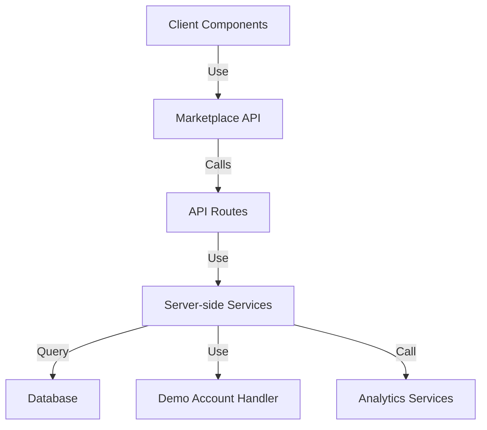

# Marketplace Architecture

The marketplace module follows the domain-based architecture pattern of the BuildAppsWith platform, providing a dedicated set of files for builder discovery, profile management, and analytics functionality.

## Module Structure

The marketplace module is organized as follows:

```
/lib/marketplace/
├── actions.ts        # Server actions
├── api.ts            # Client-side API functions
├── schemas.ts        # Zod schemas
├── types.ts          # Type definitions
├── utils.ts          # Utility functions
├── index.ts          # Barrel exports
└── data/             # Server-side data services
    ├── marketplace-service.ts  # Core marketplace data operations
    ├── analytics-service.ts    # Analytics-specific operations
    └── demo-account-handler.ts # Demo account utilities
```

## Architecture Principles

### 1. Separation of Concerns

- **Client-side vs Server-side**: Clear separation between client API functions (`api.ts`) and server-side data services (`data/marketplace-service.ts`)
- **Domain Boundaries**: The marketplace module encapsulates all marketplace-related functionality
- **Type Safety**: Shared types defined in `types.ts` ensure consistency across the module

### 2. API Design

The module exposes three primary API areas:

1. **Builder Discovery**: Functions for searching, filtering, and fetching builder profiles
2. **Analytics**: Functions for accessing and analyzing builder performance metrics
3. **Filter Management**: Functions for retrieving marketplace filter options

### 3. Data Flow



## Key Design Decisions

### Design Decision: Hybrid Architecture

The marketplace module uses a hybrid architecture that combines:

- **Client-side API functions** in `api.ts` (follow REST patterns)
- **Server-side data services** in the `data/` directory (database operations)

This approach allows for:
- Clean separation between presentation and data access
- Optimized data operations on the server
- Secure access control at the API route level

### Design Decision: Consolidated Type System

All marketplace types are defined in a single `types.ts` file, which serves as the source of truth for:

- Builder profile structures
- Marketplace filters
- Analytics data structures

This ensures consistency across client and server implementations and simplifies maintenance.

### Design Decision: Feature Flagging

The marketplace module supports feature flagging through:

- Demo account handling
- Feature-specific filters
- Environment-based configuration

## Implementation Principles

### Client-Side API Functions

Client-side API functions in `api.ts`:
- Use fetch to call API endpoints
- Handle error states gracefully
- Return typed responses
- Support pagination and filtering

Example:
```typescript
export async function fetchBuilders(
  page: number = 1, 
  limit: number = 9,
  filters?: MarketplaceFilters
): Promise<BuildersResponse> {
  // Implementation...
}
```

### Server-Side Data Services

Server-side data services in `data/marketplace-service.ts`:
- Perform direct database operations
- Implement business logic
- Handle data transformations
- Manage security and access control

Example:
```typescript
export async function fetchBuilders(
  page: number = 1,
  limit: number = 9,
  filters?: MarketplaceFilters
): Promise<PaginatedResponse<BuilderProfileListing>> {
  // Database operations & business logic...
}
```

## Evolution & Migration

The marketplace module has evolved from a simple list of builders to a comprehensive marketplace for developer services. Key migrations include:

1. Addition of analytics capabilities
2. Enhanced filtering options
3. Migration to the domain-based architecture
4. Consolidation of duplicated code

Recent improvements focused on eliminating duplication between:
- `api.ts` and `data-service.ts` (client-side operations)
- Multiple implementations of the same functionality

## Future Directions

Planned enhancements to the marketplace architecture include:

1. **Full migration to Nx libraries**: Moving the marketplace module to a dedicated Nx library
2. **Enhanced analytics**: More comprehensive builder performance metrics
3. **API versioning**: Supporting multiple versions of the marketplace API
4. **GraphQL integration**: Adding GraphQL support for more flexible data fetching
