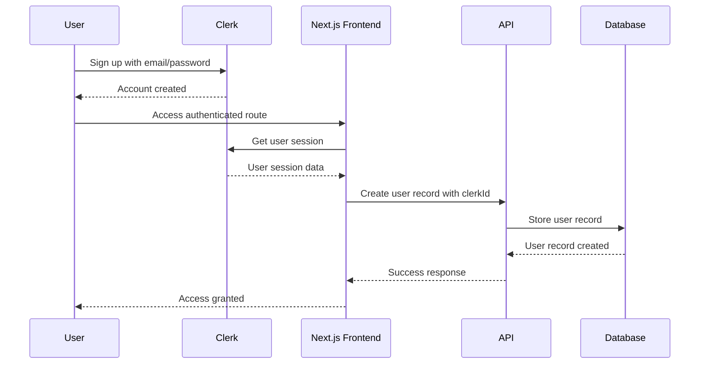

# Clerk-Database Synchronization Mechanism

This document outlines how user data flows between Clerk (our authentication provider) and our database, which is critical for implementing proper test user provisioning.

## Overview

BuildAppsWith uses a hybrid approach for user management:
- **Clerk**: Handles authentication, session management, and core user identity
- **PostgreSQL Database**: Stores application-specific user data, profiles, and relationships

The synchronization between these systems is crucial for maintaining consistent user states across our application.

## Sync Patterns

### 1. Initial User Creation

When a user signs up through Clerk, the following process occurs:



### 2. User Record Synchronization

The `clerkId` field in our database serves as the link between Clerk and our database records:

```
Clerk User (id: "clerk_abc123") <-> Database User (clerkId: "clerk_abc123")
```

### 3. Webhook-Based Updates

Clerk webhooks trigger database updates when user data changes:

1. User updates profile in Clerk
2. Clerk sends webhook event to our API
3. API handler updates database record with new information

## Implementation Details

### User Model Mapping

| Clerk Field | Database Field | Notes |
|-------------|----------------|-------|
| `id` | `clerkId` | Primary linkage between systems |
| `emailAddress` | `email` | Email uniqueness is enforced in both systems |
| `firstName + lastName` | `name` | Combined in database |
| `imageUrl` | `imageUrl` | Profile image |
| `publicMetadata.roles` | `roles` | User role array (CLIENT, BUILDER, ADMIN) |
| `publicMetadata.verified` | `verified` | Verification status |
| `publicMetadata.stripeCustomerId` | `stripeCustomerId` | For payment integration |

### Code Implementation

The synchronization logic exists primarily in these locations:

1. Auth API routes (for initial creation)
2. Clerk webhook handlers (for updates)
3. `useUser` hook in `clerk-hooks.ts` (for client-side transformation)

#### Key Files

- `/lib/auth/clerk-hooks.ts`: Client-side hooks that transform Clerk user data
- `/lib/auth/clerk-middleware.ts`: Server-side middleware for authentication
- `/app/api/webhooks/clerk/route.ts`: Webhook handler for Clerk events
- `/lib/auth/api.ts`: API functions for user management

## Synchronization Challenges

1. **Race Conditions**: Multiple concurrent updates can lead to inconsistent states
2. **Webhook Failures**: Network issues or service interruptions can cause missed updates
3. **Data Divergence**: Over time, the two systems can get out of sync

## Test User Synchronization

For test users, we need to ensure:

1. **Bidirectional Creation**: Test users must exist in both Clerk and the database
2. **Consistent Identifiers**: `clerkId` values must match between systems
3. **Complete Profiles**: All required profile data exists in both systems
4. **Role Assignment**: User roles are correctly assigned in both Clerk metadata and database

## Testing Synchronization

To test the synchronization mechanism:

1. Create a user in Clerk via the Admin API
2. Verify webhook creates corresponding database record
3. Update user in Clerk
4. Verify database record is updated
5. Test authentication flows to ensure session data is correctly mapped

## Edge Cases

1. **Deleted Users**: If a user is deleted in Clerk but exists in the database
2. **Missing Metadata**: If Clerk user lacks required metadata
3. **Invalid Roles**: If roles in Clerk don't match available roles in the database
4. **Email Changes**: If email is updated in Clerk, database must be synchronized

## Implementing Test User Provisioning

For reliable test user provisioning:

1. Create users in Clerk first (via Admin API)
2. Set all required metadata in Clerk
3. Manually create corresponding database records with matching `clerkId`
4. Create additional related records (profiles, settings, etc.)
5. Verify bidirectional access works correctly

This approach ensures test users are properly recognized by both systems and can be used for comprehensive testing of authenticated flows.