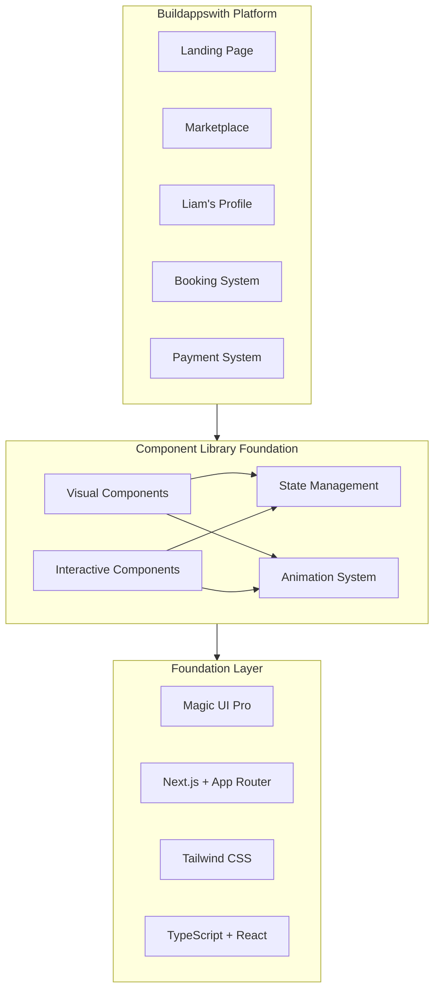
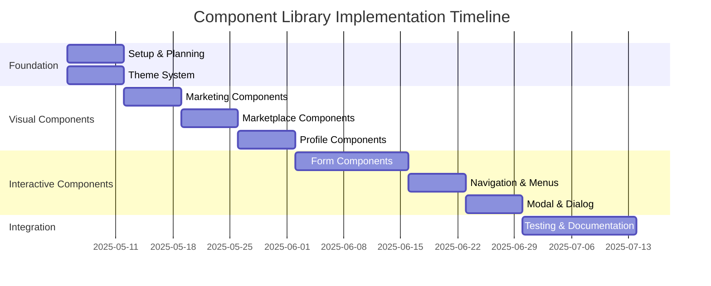

# Component Library Architecture

**Linear Project**: MVP Revenue Foundation  
**Issue**: BUI-89 - Component Library Foundation  
**Date**: May 5, 2025  
**Version**: 1.0

## 1. Architecture Overview

### 1.1 Core Architecture

The Component Library architecture combines visual and interactive components in a domain-driven organization structure, supporting the critical path implementation outlined in PRD 3.1.



### 1.2 Architectural Principles

1. **Domain-Driven Organization**: Components organized by business domain first
2. **Component Composition**: Complex components built by composing simpler ones
3. **Separation of Concerns**: Logic separated from presentation 
4. **Accessibility**: WCAG 2.1 AA standards throughout
5. **Performance**: Server-first approach with selective client components
6. **Maintainability**: Clear documentation and testing
7. **Reusability**: Components designed for reuse across domains

### 1.3 Domain Organization

```
/components
├── marketing/       # Landing page components
├── marketplace/     # Builder discovery components
├── profile/         # User profile components
├── trust/           # Trust indicators
├── booking/         # Scheduling components
├── payment/         # Payment processing
├── learning/        # Learning experience
├── community/       # Community features
├── ui/              # Shared UI components
└── providers/       # Context providers
```

## 2. Component Categories

### 2.1 Visual Components

Visual components focus on presentation and styling, with limited interactivity:

1. **Marketing Components**: Landing page elements (header, hero, CTA)
2. **Marketplace Components**: Builder cards, grids, and discovery interfaces
3. **Profile Components**: Profile headers, cards, and information displays
4. **Trust Components**: Validation badges, testimonials, and trust indicators

### 2.2 Interactive Components

Interactive components focus on user interactions and state management:

1. **Form Components**: Inputs, selects, checkboxes, validation
2. **Navigation Components**: Tabs, accordions, dropdowns, menus
3. **Overlay Components**: Modals, dialogs, popovers, tooltips
4. **Selection Components**: Date pickers, time selectors, multi-select

### 2.3 Component Hierarchy

The architecture follows a layered approach:

```
Page Components
    │
    ▼
Domain Components
    │
    ▼
Shared UI Components
    │
    ▼
Base Components (Magic UI Pro)
```

## 3. Magic UI Pro Integration

### 3.1 Integration Approach

Magic UI Pro components will be installed directly using the shadcn-ui pattern:

```bash
pnpm dlx shadcn@latest add "https://magicui.design/r/[component].json"
```

**Important Notes**:
- We will NOT migrate components from `/components/historic-magicui/`
- All components will be fresh installations
- Reference Magic UI templates for implementation patterns
- Any issues with Magic UI require immediate reassessment, not workarounds

### 3.2 Component Customization

Magic UI Pro components can be customized through:

1. **Tailwind Utilities**: Apply Tailwind classes for styling
2. **Props Configuration**: Modify behavior through component props
3. **Theme Configuration**: Adjust theme variables in Tailwind config
4. **Component Extension**: Create new components that extend Magic UI

### 3.3 Priority Magic UI Components

| Component | Variant | Primary Domain | Purpose |
|-----------|---------|----------------|---------|
| Header | 2 | Marketing | Main navigation |
| Hero | 1 | Marketing | Landing page banner |
| Social Proof | 1 | Trust | Display trusted partners |
| Feature Scroll | 1 | Marketing | Showcase features |
| Animated Card | 7, 9, 10 | Marketplace, Profile | Display builders/profiles |
| Call to Action | Multiple | Marketing | Drive conversions |

## 4. State Management

### 4.1 State Management Approach

The architecture uses React's built-in state management:

1. **Local Component State**: `useState` for component-specific state
2. **React Context**: For shared state across component trees
3. **Custom Hooks**: For encapsulating reusable state logic
4. **Form Library**: `react-hook-form` with Zod for validation

### 4.2 Key State Patterns

1. **Container/Presenter Pattern**: Separate logic from presentation
2. **Lifting State Up**: Parent components manage shared state
3. **Derived State**: Calculate state from props/state with `useMemo`
4. **Context Providers**: Domain-specific context providers

## 5. Component Implementation

### 5.1 Implementation Timeline



### 5.2 Component Implementation Priorities

Following PRD 3.1 critical path:

1. **Landing Page**: Marketing components - fastest path to value
2. **Marketplace**: Builder discovery components - critical for revenue
3. **Liam's Profile**: Profile components - essential for booking
4. **Booking System**: Calendar and form components - revenue generation

### 5.3 Testing Strategy

1. **Unit Testing**: Component functionality and props
2. **Integration Testing**: Component interactions
3. **Accessibility Testing**: WCAG 2.1 AA compliance
4. **Visual Testing**: Component appearance and responsiveness

## 6. Key Linear Issues

The component library implementation has been organized in Linear:

- **BUI-89**: Component Library Foundation (parent)
  - **BUI-90**: Magic UI Pro Component Research and Selection
  - **BUI-91**: Component Architecture and Organization
  - **BUI-92**: Core UI Component Implementation
  - **BUI-93**: Domain-Specific Visual Components
  - **BUI-94**: Documentation and Usage Guidelines
  - **BUI-95**: Component Testing Framework
  - **BUI-96**: Visual Theming System
  - **BUI-97**: Interactive Component Architecture
  - **BUI-98**: Form Component Implementation
  - **BUI-99**: Modal and Dialog Components
  - **BUI-100**: Navigation and Menu Components
  - **BUI-101**: Interactive State Management
  - **BUI-102**: Animation and Transition Framework

## 7. Risks and Mitigations

| Risk | Probability | Impact | Mitigation |
|------|------------|--------|------------|
| Magic UI Pro limitations | Medium | High | Create custom components for gaps |
| Accessibility compliance | Medium | High | Build accessibility testing into development |
| Mobile interaction challenges | Medium | High | Mobile-first design approach |
| State management complexity | Medium | High | Start simple, escalate as needed |
| Component styling conflicts | Medium | Medium | Clear CSS scoping with Tailwind |

## 8. Next Steps

1. Complete implementation readiness checklist
2. Set up development environment with Magic UI Pro
3. Implement base UI components with theming
4. Begin marketing component implementation
5. Establish testing frameworks and documentation

---

This document consolidates the architectural vision for the Component Library Foundation, providing a clear roadmap for implementation while ensuring alignment with PRD 3.1 objectives.